// FIXME: Проверить все mermaid-диаграммы

# Проектная работа "Веб-ларек"

Стек: HTML, SCSS, TS, Webpack

Структура проекта:

- src/ — исходные файлы проекта
- src/components/ — папка с JS компонентами
- src/components/base/ — папка с базовым кодом

Важные файлы:

- index.html — HTML-файл главной страницы
- src/types/index.ts — файл с типами
- src/main.ts — точка входа приложения
- src/scss/styles.scss — корневой файл стилей
- src/utils/constants.ts — файл с константами
- src/utils/utils.ts — файл с утилитами

## Установка и запуск

Для установки и запуска проекта необходимо выполнить команды

```sh
npm install
npm run dev
```

или

```sh
yarn
yarn dev
```

## Сборка

```sh
npm run build
```

или

```sh
yarn build
```

# Интернет-магазин «Web-Larёk»

«Web-Larёk» — это интернет-магазин с товарами для веб-разработчиков, где пользователи могут просматривать товары, добавлять их в корзину и оформлять заказы. Сайт предоставляет удобный интерфейс с модальными окнами для просмотра деталей товаров, управления корзиной и выбора способа оплаты, обеспечивая полный цикл покупки с отправкой заказов на сервер.

## Архитектура приложения

Код приложения разделен на слои согласно парадигме `MVP` (`Model-View-Presenter`), которая обеспечивает четкое разделение ответственности между классами слоев `Model` и `View`. Каждый слой несет свой смысл и ответственность:

`Model` - слой данных, отвечает за хранение и изменение данных.  
`View` - слой представления, отвечает за отображение данных на странице.  
`Presenter` - презентер содержит основную логику приложения и отвечает за связь представления и данных.

Взаимодействие между классами обеспечивается использованием событийно-ориентированного подхода. Модели и Представления генерируют события при изменении данных или взаимодействии пользователя с приложением, а Презентер обрабатывает эти события используя методы как Моделей, так и Представлений.

### Базовый код

#### Класс Component

Является базовым классом для всех компонентов интерфейса.
Класс является дженериком и принимает в переменной `T` тип данных, которые могут быть переданы в метод `render` для отображения.

Конструктор:  
`constructor(container: HTMLElement)` - принимает ссылку на DOM элемент за отображение, которого он отвечает.

Поля класса:  
`container: HTMLElement` - поле для хранения корневого DOM элемента компонента.

Методы класса:  
`render(data?: Partial<T>): HTMLElement` - Главный метод класса. Он принимает данные, которые необходимо отобразить в интерфейсе, записывает эти данные в поля класса и возвращает ссылку на DOM-элемент. Предполагается, что в классах, которые будут наследоваться от `Component` будут реализованы сеттеры для полей с данными, которые будут вызываться в момент вызова `render` и записывать данные в необходимые DOM элементы.  
`setImage(element: HTMLImageElement, src: string, alt?: string): void` - утилитарный метод для модификации DOM-элементов ``

#### Класс Api

Содержит в себе базовую логику отправки запросов.

Конструктор:  
`constructor(baseUrl: string, options: RequestInit = {})` - В конструктор передается базовый адрес сервера и опциональный объект с заголовками запросов.

Поля класса:  
`baseUrl: string` - базовый адрес сервера  
`options: RequestInit` - объект с заголовками, которые будут использованы для запросов.

Методы:  
`get(uri: string): Promise<object>` - выполняет GET запрос на переданный в параметрах ендпоинт и возвращает промис с объектом, которым ответил сервер  
`post(uri: string, data: object, method: ApiPostMethods = 'POST'): Promise<object>` - принимает объект с данными, которые будут переданы в JSON в теле запроса, и отправляет эти данные на ендпоинт переданный как параметр при вызове метода. По умолчанию выполняется `POST` запрос, но метод запроса может быть переопределен заданием третьего параметра при вызове.  
`handleResponse(response: Response): Promise<object>` - защищенный метод проверяющий ответ сервера на корректность и возвращающий объект с данными полученный от сервера или отклоненный промис, в случае некорректных данных.

#### Класс EventEmitter

Брокер событий реализует паттерн "Наблюдатель", позволяющий отправлять события и подписываться на события, происходящие в системе. Класс используется для связи слоя данных и представления.

Конструктор класса не принимает параметров.

Поля класса:  
`_events: Map<string | RegExp, Set<Function>>)` - хранит коллекцию подписок на события. Ключи коллекции - названия событий или регулярное выражение, значения - коллекция функций обработчиков, которые будут вызваны при срабатывании события.

Методы класса:  
`on<T extends object>(event: EventName, callback: (data: T) => void): void` - подписка на событие, принимает название события и функцию обработчик.  
`emit<T extends object>(event: string, data?: T): void` - инициализация события. При вызове события в метод передается название события и объект с данными, который будет использован как аргумент для вызова обработчика.  
`trigger<T extends object>(event: string, context?: Partial<T>): (data: T) => void` - возвращает функцию, при вызове которой инициализируется требуемое в параметрах событие с передачей в него данных из второго параметра.

### Данные

#### Типы медотов API-запросов - `ApiPostMethods`

Предназначен для обеспечения типизации методов API-запросов.

```ts
type ApiPostMethods = "POST" | "PUT" | "DELETE";
```

Представление `IApi` и `ApiPostMethods` на UML-диаграмме

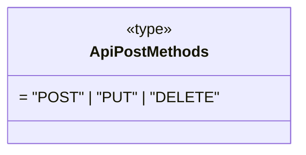

#### API-интерфейсы: `IApi`, `ILarekProducts`, `IOrderData` и `IPurchaseData`

##### `IApi`

Определяет наличие у реализующих и использующих в рамках композиции его сущностей, в частности, констуктора специализированного класса `larekAPI`, следующих API-методов:

- `get()` - типизированного метода запроса на получение данных, который принимает адрес `uri` и возвращает типизированный промис ответа
- `post()` - типизированного метода запроса на внесение изменений (`POST` | `PUT`) или удаление (`DELETE`) данных, который принимает адрес `uri`, объект передаваемых данных `data`, тип метода запроса `method`, а возвращает типизированный промис ответа

```ts
interface IApi {
  get<T extends object>(uri: string): Promise<T>;
  post<T extends object>(
    uri: string,
    data: object,
    method?: ApiPostMethods
  ): Promise<T>;
}
```

Представление `IApi` на UML-диаграмме

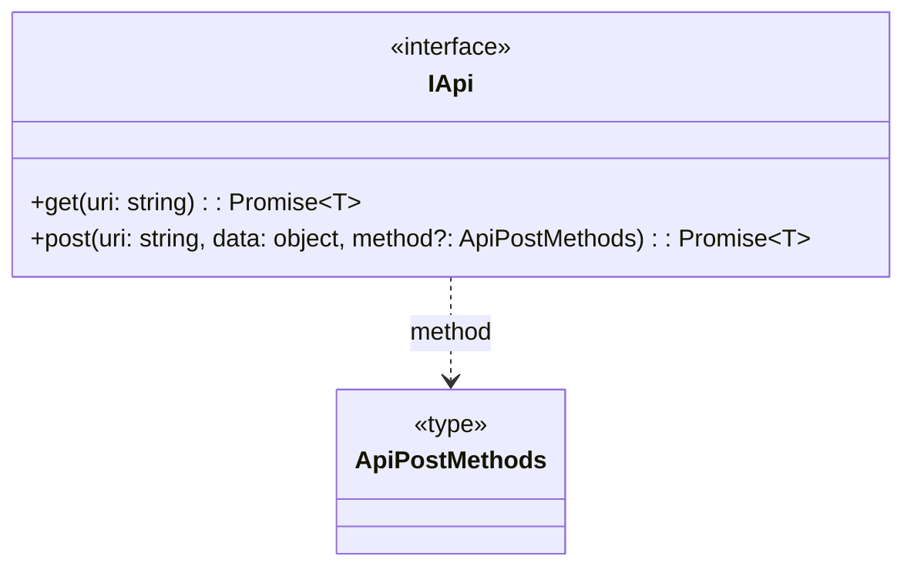

##### `ILarekProducts` - тип успешного ответа сервера на запрос списка товаров

```ts
interface ILarekProducts {
  total: number; // количество товаров
  items: IProduct[]; // массив товаров типа IProduct
}
```

Представление `ILarekProducts` на UML-диаграмме

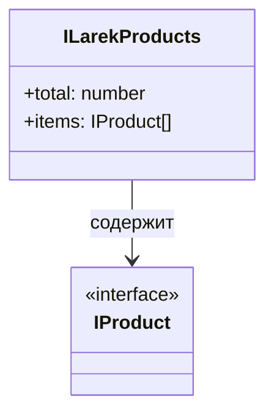

##### `IOrderData` - тип данных, передаваемых в теле запроса при оформлении заказа (покупке)

```ts
interface IOrderData extends IBuyer {
  total: Price; // стоимость товаров в корзине
  items: UUID[]; // массив идентификаторов товаров в корзине
}
```

Представление `IOrderData` на UML-диаграмме

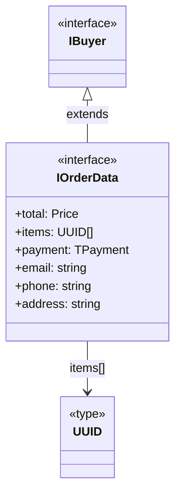

##### `IPurchaseData` - тип ответа сервера при успешном оформлении заказа (покупке)

```ts
interface IPurchaseData {
  id: UUID[]; // идентификатор заказа
  total: Price; // стоимость покупки
}
```

Представление `IPurchaseData` на UML-диаграмме

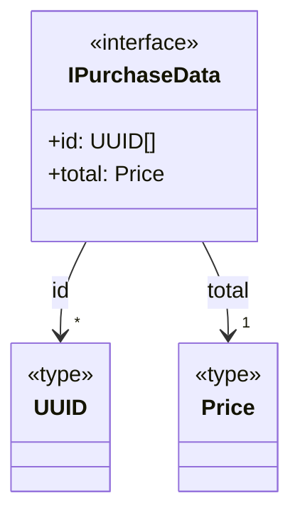

#### Базовые типы для работы со списками и заказом

##### `IdType` - тип уникального ключа товара

Ключом может выступать любое свойство элемента списка, хранящее уникальные значения (для товара - `id`).

```ts
type IdType = typeof ID_NAME; // ID_NAME - ключ-свойство товара
```

##### `UUID` - тип, определяющий структуру уникального ключа товара

```ts
type UUID = `${string}-${string}-${string}-${string}-${string}`;
```

##### `Price` - стоимость товара

```ts
type Price = number;
```

##### `TPayment` - способ оплаты

```ts
type TPayment = "online" | "cash" | undefined;
```

Представление базовых типов для работы со списками и заказом на UML-диаграмме

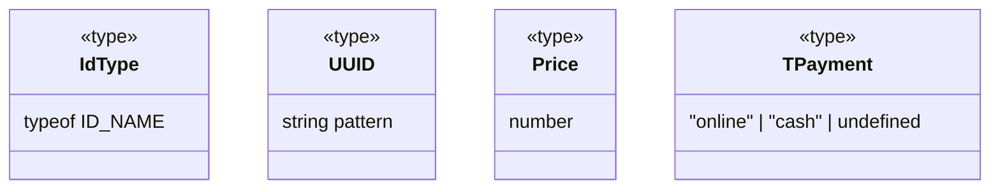

#### Товар - `IProduct`

Описывает основную абстракцию, товар, со следующими свойствами:

- `image` -
- `title` -
- `category` -
- `price` -

```ts
interface IProduct {
  readonly id: UUID; // уникальный идентификатор товара типа `UUID` (не должен изменяться)
  description: string; // описание товара
  image: string; // фрагмент пути к файлу картинки товара
  title: string; // название товара
  category: string; // категория товара
  price: Price | null; // цена (null для непродаваемых товаров)
}
```

Представление `IProduct` на UML-диаграмме

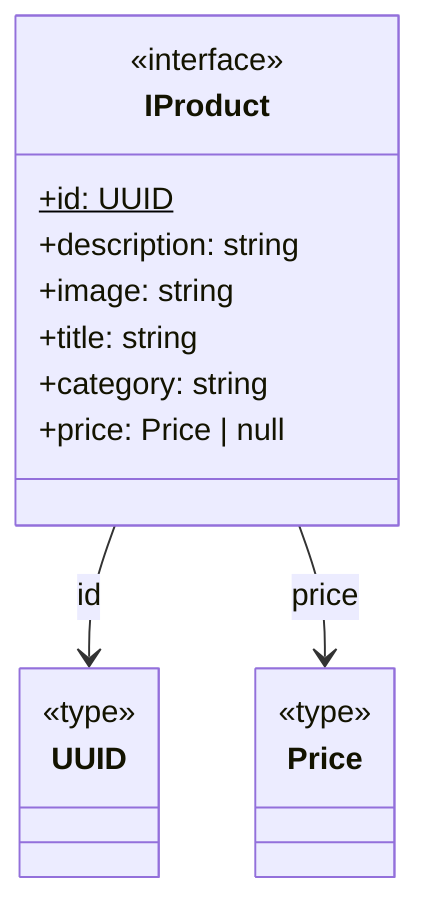

#### Универсальный список - `IList`

`IList` - интерфейс, описывающий абстрактный переиспользуемый список, построенный на основе Map-коллекции. На его основе созданы расширением специализированные интерфейсы каталога (`ICatalog`) и корзины (`IBasket`) со специфическими для этих сущностей свойствами и методами. Элементы списков каталога и корзины - товары, ключи - их уникальные идентификаторы. Обладает следующими свойствами и методами:

```ts
interface IList<T, Key extends keyof T> {
  items: T[]; // массив элементов списка
  size: number; // количество элементов в списке
  addItem(item: T): void; // метод добавления элемента в список
  addItems(items: readonly T[]): void; // метод добавления массива элементов в список
  getItemByKey(key: T[Key]): T | undefined; // метод вывода элемента из списка по его ключу
  removeByKey(key: T[Key]): boolean; // метод удаления элемента из списка по его ключу
  clear(): void; // метод очистки списка
  hasKey(key: T[Key]): boolean; // метод проверки наличия элемента в списке по его ключу
}
```

Представление `IList` на UML-диаграмме

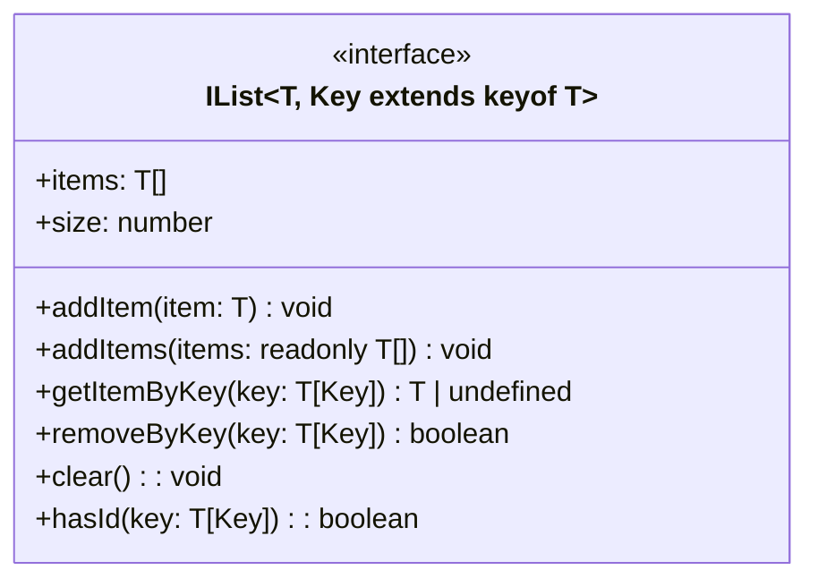

#### Каталог товаров - `ICatalog`

`ICatalog` определяет методы и свойства каталога товаров, расширяя и специализируя `IList` с помощью:

- `IProduct`, определяющего тип хранимых в списке элементов как товар
- `'id'`, определяющего имя свойства `IProduct` как ключ для работы со списком (каталогом).

`ICatalog` расширяет `IList` следующими свойствами и методом:

```ts
interface ICatalog extends IList<IProduct, IdType> {
  products: IProduct[]; // список (массив) товаров каталога
  preview: IProduct | undefined; // товар, выбранный для подробного отображения
  getProductById(productId: UUID): IProduct | undefined; // метод получения товара по идентификатору
}
```

`ICatalog` на UML-диаграмме:

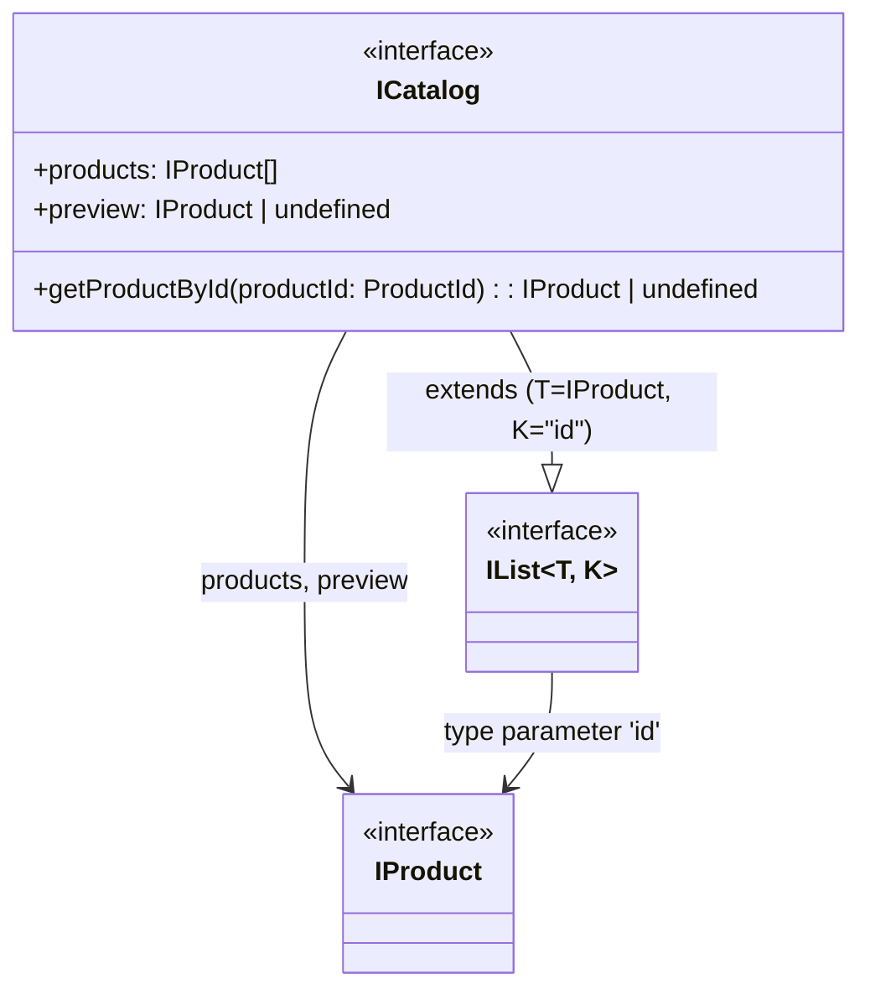

#### Корзина товаров - `IBasket`

`IBasket` аналогично `ICatalog` расширяет и специализирует `IList`, аналогично `ICatalog`. Он добавляет к `IList` следующие свойства и методы:

- `hasProduct(productId: ProductId): boolean` - метод проверки наличия товара в корзине по его идентификатору, являющийся оберткой метода `hasKey()` интерфейса `IList`

```ts
interface IBasket extends IList<IProduct, IdType> {
  products: IProduct[]; // список товаров в корзине
  total: Price; // стоимость корзины
  countProducts: number; // количество товаров в корзине
  addProduct(productId: UUID): void; // метод добавления товара в корзину по его идентифмкатору productId
  delProduct(productId: UUID): void; // метод удаления товара из корзины по его идентифмкатору productId
  clear(): void; // метод очистки корзины
  hasProduct(productId: UUID): boolean; // метод проверки наличия товара в корзине по его идентикатору
  getProductsId(): UUID[]; // метод получения массива идентификаторов товаров корзины
}
```

`IBasket` на UML-диаграмме:

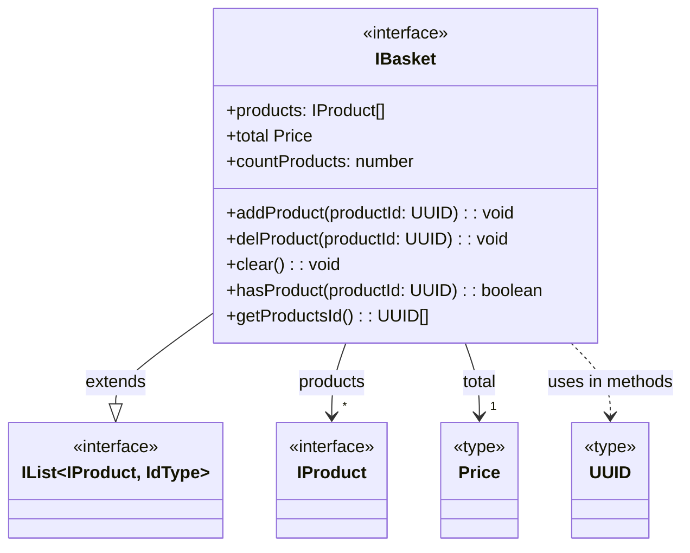

#### Покупатель - `IBuyer`

Описывает данные заказчика (покупателя):

```ts
interface IBuyer {
  payment: TPayment; // способ оплаты
  email: string; // email
  phone: string; // номер телефона
  address: string; // адрес
}
```

Представление `IBuyer` на UML-диаграмме

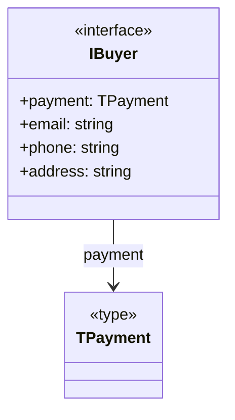

#### Заказ (покупка) - `IOrder`

Интегрирует данные корзины и покупателя для описания ключевой сущности - ЗАКАЗ.  
Используется для описания типа данных, формируемых для отправки (оформления/регистрации) заказа.

```ts
interface IOrder {
  orderData: IOrderData; // метод формирования данных для запроса оформления покупки
}
```

### Модели данных (`Model`)

Описание классов, которыми будет реализована работа с данными:

- [ ] описать назначение и зону ответственности класса;
- [ ] описать конструктор класса и принимаемые параметры (если они есть). Параметры конструктора нужно указать с типами принимаемых данных;
- [ ] описать поля класса. Для каждого нужно указать тип данных, который будет сохранён в поле класса. Затем описать поле класса — что оно хранит и за что отвечает;
- [ ] описать методы класса. Для каждого метода нужно указать входящие параметры и их тип (если они есть). Если метод возвращает какое-то значение, нужно описать его тип.

### Коммуникационный слой

...

## РЕКОМЕНДАЦИИ

- [ ] Для настройки селекторов использовать пример с объектом `setting` для автоматизации работы с селекторами HTML-элементов
- [ ] Список товаров в корзине и каталоге реализовать на одном подходе (классе), только у каталога не будет некоторых методов
- [ ] попробовать реализовать кэширование карточек товаров в галерее
