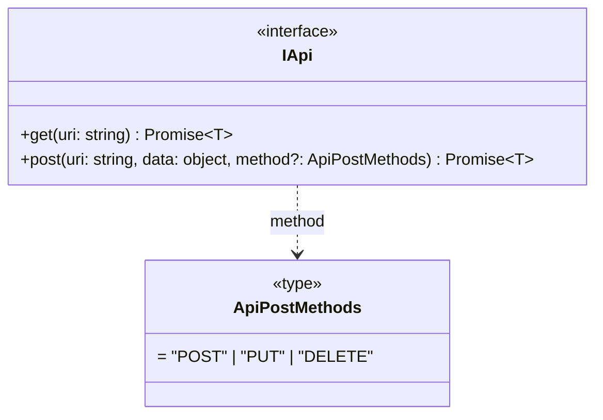
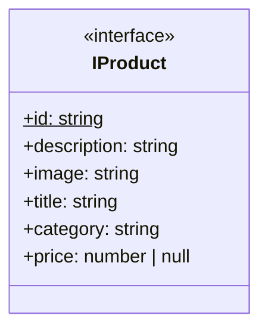
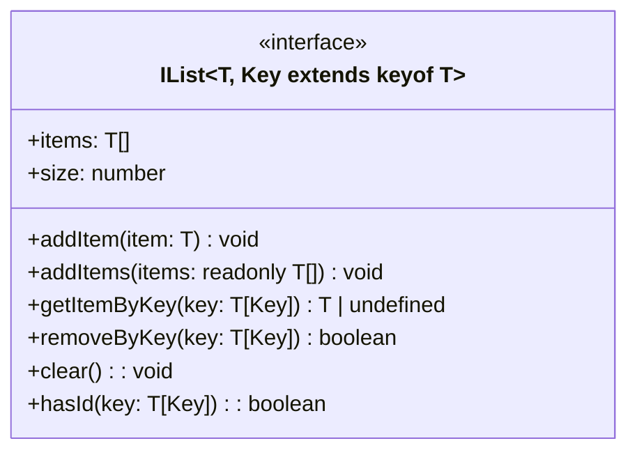
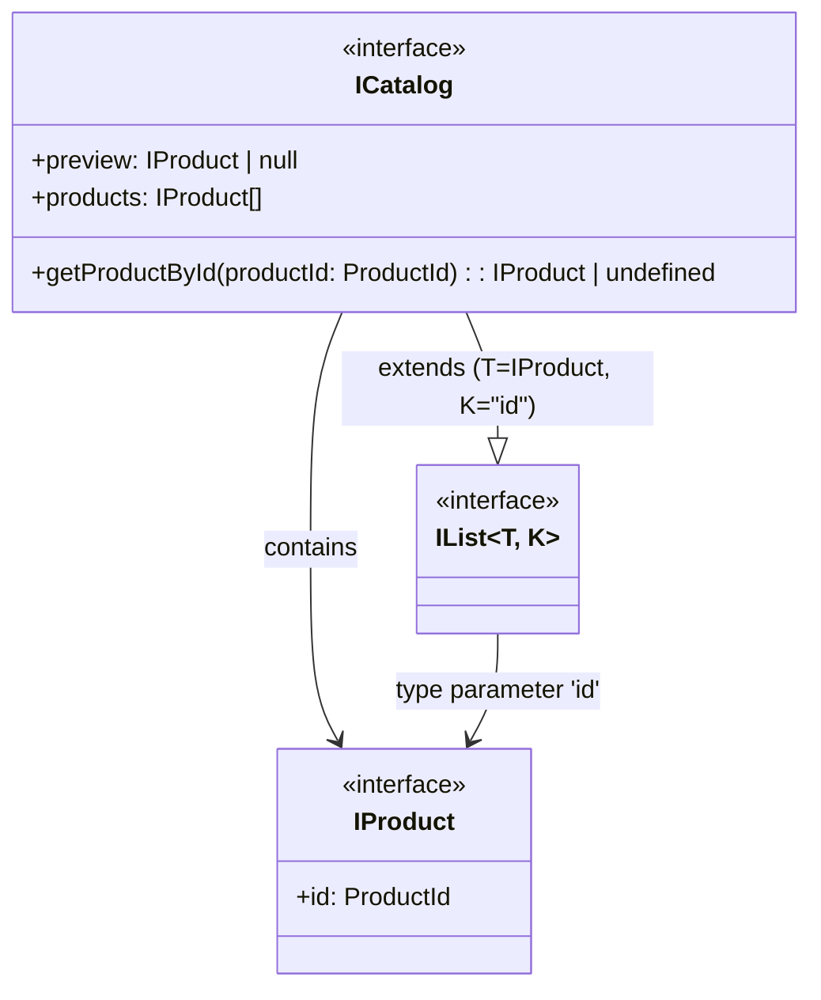
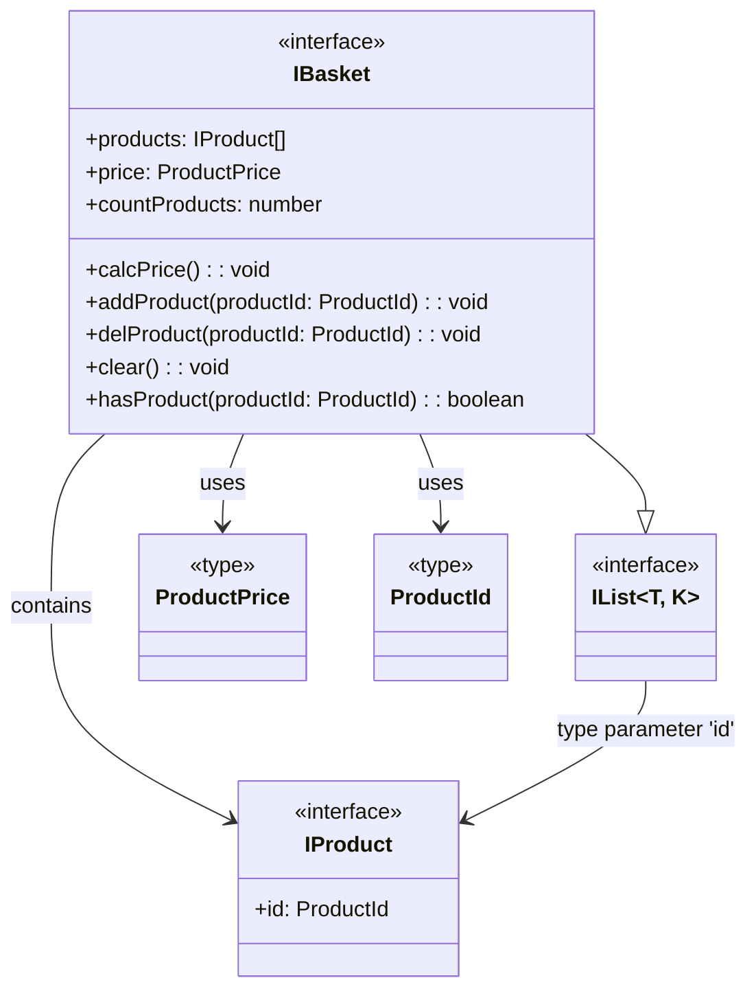
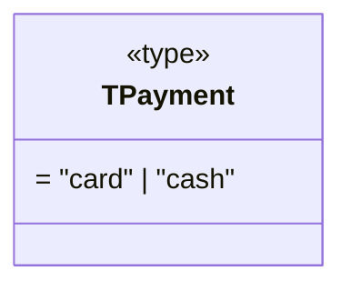
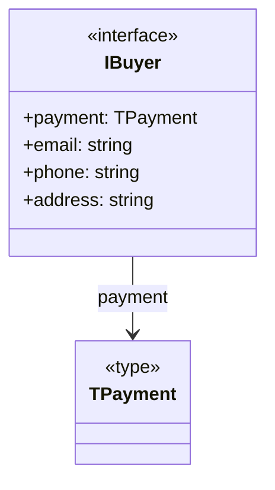

// FIXME: Проверить все mermaid-диаграммы

# Проектная работа "Веб-ларек"

Стек: HTML, SCSS, TS, Webpack

Структура проекта:

- src/ — исходные файлы проекта
- src/components/ — папка с JS компонентами
- src/components/base/ — папка с базовым кодом

Важные файлы:

- index.html — HTML-файл главной страницы
- src/types/index.ts — файл с типами
- src/main.ts — точка входа приложения
- src/scss/styles.scss — корневой файл стилей
- src/utils/constants.ts — файл с константами
- src/utils/utils.ts — файл с утилитами

## Установка и запуск

Для установки и запуска проекта необходимо выполнить команды

```sh
npm install
npm run dev
```

или

```sh
yarn
yarn dev
```

## Сборка

```sh
npm run build
```

или

```sh
yarn build
```

# Интернет-магазин «Web-Larёk»

«Web-Larёk» — это интернет-магазин с товарами для веб-разработчиков, где пользователи могут просматривать товары, добавлять их в корзину и оформлять заказы. Сайт предоставляет удобный интерфейс с модальными окнами для просмотра деталей товаров, управления корзиной и выбора способа оплаты, обеспечивая полный цикл покупки с отправкой заказов на сервер.

## Архитектура приложения

Код приложения разделен на слои согласно парадигме `MVP` (`Model-View-Presenter`), которая обеспечивает четкое разделение ответственности между классами слоев `Model` и `View`. Каждый слой несет свой смысл и ответственность:

`Model` - слой данных, отвечает за хранение и изменение данных.  
`View` - слой представления, отвечает за отображение данных на странице.  
`Presenter` - презентер содержит основную логику приложения и отвечает за связь представления и данных.

Взаимодействие между классами обеспечивается использованием событийно-ориентированного подхода. Модели и Представления генерируют события при изменении данных или взаимодействии пользователя с приложением, а Презентер обрабатывает эти события используя методы как Моделей, так и Представлений.

### Базовый код

#### Класс Component

Является базовым классом для всех компонентов интерфейса.
Класс является дженериком и принимает в переменной `T` тип данных, которые могут быть переданы в метод `render` для отображения.

Конструктор:  
`constructor(container: HTMLElement)` - принимает ссылку на DOM элемент за отображение, которого он отвечает.

Поля класса:  
`container: HTMLElement` - поле для хранения корневого DOM элемента компонента.

Методы класса:  
`render(data?: Partial<T>): HTMLElement` - Главный метод класса. Он принимает данные, которые необходимо отобразить в интерфейсе, записывает эти данные в поля класса и возвращает ссылку на DOM-элемент. Предполагается, что в классах, которые будут наследоваться от `Component` будут реализованы сеттеры для полей с данными, которые будут вызываться в момент вызова `render` и записывать данные в необходимые DOM элементы.  
`setImage(element: HTMLImageElement, src: string, alt?: string): void` - утилитарный метод для модификации DOM-элементов ``

#### Класс Api

Содержит в себе базовую логику отправки запросов.

Конструктор:  
`constructor(baseUrl: string, options: RequestInit = {})` - В конструктор передается базовый адрес сервера и опциональный объект с заголовками запросов.

Поля класса:  
`baseUrl: string` - базовый адрес сервера  
`options: RequestInit` - объект с заголовками, которые будут использованы для запросов.

Методы:  
`get(uri: string): Promise<object>` - выполняет GET запрос на переданный в параметрах ендпоинт и возвращает промис с объектом, которым ответил сервер  
`post(uri: string, data: object, method: ApiPostMethods = 'POST'): Promise<object>` - принимает объект с данными, которые будут переданы в JSON в теле запроса, и отправляет эти данные на ендпоинт переданный как параметр при вызове метода. По умолчанию выполняется `POST` запрос, но метод запроса может быть переопределен заданием третьего параметра при вызове.  
`handleResponse(response: Response): Promise<object>` - защищенный метод проверяющий ответ сервера на корректность и возвращающий объект с данными полученный от сервера или отклоненный промис, в случае некорректных данных.

#### Класс EventEmitter

Брокер событий реализует паттерн "Наблюдатель", позволяющий отправлять события и подписываться на события, происходящие в системе. Класс используется для связи слоя данных и представления.

Конструктор класса не принимает параметров.

Поля класса:  
`_events: Map<string | RegExp, Set<Function>>)` - хранит коллекцию подписок на события. Ключи коллекции - названия событий или регулярное выражение, значения - коллекция функций обработчиков, которые будут вызваны при срабатывании события.

Методы класса:  
`on<T extends object>(event: EventName, callback: (data: T) => void): void` - подписка на событие, принимает название события и функцию обработчик.  
`emit<T extends object>(event: string, data?: T): void` - инициализация события. При вызове события в метод передается название события и объект с данными, который будет использован как аргумент для вызова обработчика.  
`trigger<T extends object>(event: string, context?: Partial<T>): (data: T) => void` - возвращает функцию, при вызове которой инициализируется требуемое в параметрах событие с передачей в него данных из второго параметра.

### Данные

#### Типы медотов API-запросов - `ApiPostMethods`

Предназначен для обеспечения типизации методов API-запросов.

```ts
type ApiPostMethods = "POST" | "PUT" | "DELETE";
```

#### API-интерфейс: `IApi`

Определяет наличие у реализующих его сущностей следующих API-методов:

- `get()` - типизированного метода запроса на получение данных, который принимает адрес `uri` и возвращает типизированный промис ответа
- `post()` - типизированного метода запроса на внесение изменений ("POST" | "PUT") или удаление ("DELETE") данных, который принимает адрес `uri`, объект с передаваемыми данными `data`, тип метода завпроса `method`, а возвращает промис ответа

```ts
interface IApi {
  get<T extends object>(uri: string): Promise<T>;
  post<T extends object>(
    uri: string,
    data: object,
    method?: ApiPostMethods
  ): Promise<T>;
}
```

Представление `IApi` и `ApiPostMethods` на UML-диаграмме



#### Товар - `IProduct`

Описывает основную абстракцию, товар, со следующими свойствами:

- `id` - уникальный идентификатор (uuid) товара (не должен изменяться - `readonly`)
- `description` - описание товара
- `image` - фрагмент пути к файлу картинки товара
- `title` - название товара
- `category` - категория товара
- `price` - цена (опционально, может быть NULL для непродаваемых товаров)

```ts
interface IProduct {
  readonly id: string;
  description: string;
  image: string;
  title: string;
  category: string;
  price: number | null;
}
```

Представление `IProduct` на UML-диаграмме



Производные типы от `IProduct`:

- уникальный идентификатор товара

  ```ts
  type ProductId = IProduct["id"];
  ```

- cтоимость товара

  ```ts
  type ProductPrice = IProduct["price"];
  ```

#### Абстрактный список - `IList`

`IList` - интерфейс, описывающий абстрактный переиспользуемый список, построенный на основе Map-коллекции. На его основе созданы интерфейсы каталога (`ICatalog`) и корзины (`IBasket`) со специфическими для этих сущностей свойствами и методами.

`IList` имеет следующие свойства:

- `items` - массив элементов (товаров), хранимых в списке (коллекции)
- `size` - размер списка (количество товаров в соответствующем списке)

и методы:

1. `addItem(item: T): void` - метод добавления элемента (товара) в список
2. `addItems(items: readonly T[]): void` - метод добавления массива элементов (товаров) в список
3. `getItemByKey(key: T[Key]): T | undefined` - метод вывода элемента (товара) из списка по его ключу (идентификатору)
4. `removeByKey(key: T[Key]): boolean` - метод удаления элемента (товара) из списка по его ключу (идентификатору)
5. `clear(): void` - метод очистки списка
6. `hasKey(key: T[Key]): boolean` - метод проверки наличия элемента (товара) в списке по его ключу (идентификатору)

```ts
interface IList<T, Key extends keyof T> {
  items: T[];
  size: number;
  addItem(item: T): void;
  addItems(items: readonly T[]): void;
  getItemByKey(key: T[Key]): T | undefined;
  removeByKey(key: T[Key]): boolean;
  clear(): void;
  hasKey(key: T[Key]): boolean;
}
```

Представление `IList` на UML-диаграмме



#### Каталог товаров - `ICatalog`

`ICatalog` расширяет `IList`, специализируя его спомощью:

- `IProduct`, определяющего тип хранимых в абстрактном списке элементов как товар
- `'id'`, определяющего имя свойства `IProduct`, выступающего ключом при работе с абстрактным списком, построенным в виде Map-коллекции.

`ICatalog` добавляет следующие свойства и методы:

- `preview: IProduct | null` - товар, выбранный для подробного отображения
- `products: IProduct[]` - список товаров каталога
- `getProductById(productId: ProductId): IProduct | undefined` - метод получения товара по его идентификатору `id` (обертка метода `getItemByKey()` интерфейса `IList`)

```ts
interface ICatalog extends IList<IProduct, "id"> {
  preview: IProduct | null;
  products: IProduct[];
  getProductById(productId: ProductId): IProduct | undefined;
}
```

`ICatalog` на UML-диаграмме:



#### Корзина товаров - `IBasket`

`IBasket` аналогично `ICatalog` расширяет и специализирует `IList`. Он добавляет к `IList` следующие свойства и методы:

- `products: IProduct[]` - список товаров в корзине
- `price: ProductPrice` - стоимость товаров в корзине
- `countProducts: number` - количество товаров в корзине (свойство `size` интерфейса `IList`)
- `calcPrice(): void` - метод расчета стоимости корзины, выполняемый после каждой модификации списка корзины (для хранение актуальной стоимости)
- `addProduct(productId: ProductId): void` - метод добавление товара по его идентифмкатору `productId`, основанный на методе `addItem()` интерфейса `IList`
- `delProduct(productId: ProductId): void` - метод удаления товара из корзины по его идентифмкатору `productId`, основанный на методе `removeByKey()` интерфейса `IList`
- `clear(): void` - метод очистки корзины, основанный на методе `clear()` интерфейса `IList`
- `hasProduct(productId: ProductId): boolean` - метод проверки наличия товара в корзине по его идентификатору, являющийся оберткой метода `hasKey()` интерфейса `IList`

```ts
interface IBasket extends IList<IProduct, "id"> {
  products: IProduct[];
  price: ProductPrice;
  countProducts: number;
  calcPrice(): void;  // метод расчета стоимости корзины
  addProduct(productId: ProductId): void; // метод добавления товара в корзину
  delProduct(productId: ProductId): void; // метод удаления товараиз корзины
  clear(): void; // метод очистки корзины
  hasProduct(productId: ProductId): boolean; // метод проверки наличия товара в корзине по его идентикатору
}
```

`IBasket` на UML-диаграмме:



Аргумент `payload` методов `IBasket`, как и в случае с `ICatalog`, так же является типизированной callback-функцией, вызываемой для обработки изменения списка товаров брокером событий.

Учитывая, что тип свойств `price` (цена товара) интерфейса `IProduct` и `price` (стоимость корзины) интерфейса `IBasket` должен совпадать, выведен тип:

```ts
type ProductPrice = IProduct["price"];
```

#### Способ оплаты - `TPayment`

Обеспечивает типизацию работы со способами оплаты.

```ts
type TPayment = "card" | "cash"; // ! уточнить значения !
```

Представление `TPayment` на UML-диаграмме



#### Покупатель - `IBuyer`

Описывает данные заказа товара:

- `payment` - способ оплаты, определяемый типом `TPayment`
- `email` - электронная почта заказчика
- `phone` - телефон заказчика
- `address` - адрес доставки

```ts
interface IBuyer {
  payment: TPayment;
  email: string;
  phone: string;
  address: string;
}
```

Представление `IBuyer` на UML-диаграмме



### Модели данных (`Model`)

Описание классов, которыми будет реализована работа с данными:

- [ ] описать назначение и зону ответственности класса;
- [ ] описать конструктор класса и принимаемые параметры (если они есть). Параметры конструктора нужно указать с типами принимаемых данных;
- [ ] описать поля класса. Для каждого нужно указать тип данных, который будет сохранён в поле класса. Затем описать поле класса — что оно хранит и за что отвечает;
- [ ] описать методы класса. Для каждого метода нужно указать входящие параметры и их тип (если они есть). Если метод возвращает какое-то значение, нужно описать его тип.

### Коммуникационный слой

...

## РЕКОМЕНДАЦИИ

- [ ] Для настройки селекторов использовать пример с объектом `setting` для автоматизации работы с селекторами HTML-элементов
- [ ] Список товаров в корзине и каталоге реализовать на одном подходе (классе), только у каталога не будет некоторых методов
- [ ] попробовать реализовать кэширование карточек товаров в галерее
