# Проектная работа "Веб-ларек"

Стек: HTML, SCSS, TS, Webpack

Структура проекта:

- src/ — исходные файлы проекта
- src/components/ — папка с JS компонентами
- src/components/base/ — папка с базовым кодом

Важные файлы:

- index.html — HTML-файл главной страницы
- src/types/index.ts — файл с типами
- src/main.ts — точка входа приложения
- src/scss/styles.scss — корневой файл стилей
- src/utils/constants.ts — файл с константами
- src/utils/utils.ts — файл с утилитами

## Установка и запуск

Для установки и запуска проекта необходимо выполнить команды

```sh
npm install
npm run dev
```

или

```sh
yarn
yarn dev
```

## Сборка

```sh
npm run build
```

или

```sh
yarn build
```

# Интернет-магазин «Web-Larёk»

«Web-Larёk» — это интернет-магазин с товарами для веб-разработчиков, где пользователи могут просматривать товары, добавлять их в корзину и оформлять заказы. Сайт предоставляет удобный интерфейс с модальными окнами для просмотра деталей товаров, управления корзиной и выбора способа оплаты, обеспечивая полный цикл покупки с отправкой заказов на сервер.

## Архитектура приложения

Код приложения разделен на слои согласно парадигме `MVP` (`Model-View-Presenter`), которая обеспечивает четкое разделение ответственности между классами слоев `Model` и `View`. Каждый слой несет свой смысл и ответственность:

`Model` - слой данных, отвечает за хранение и изменение данных.  
`View` - слой представления, отвечает за отображение данных на странице.  
`Presenter` - презентер содержит основную логику приложения и отвечает за связь представления и данных.

Взаимодействие между классами обеспечивается использованием событийно-ориентированного подхода. Модели и Представления генерируют события при изменении данных или взаимодействии пользователя с приложением, а Презентер обрабатывает эти события используя методы как Моделей, так и Представлений.

### Базовый код

#### Класс Component

Является базовым классом для всех компонентов интерфейса.
Класс является дженериком и принимает в переменной `T` тип данных, которые могут быть переданы в метод `render` для отображения.

Конструктор:  
`constructor(container: HTMLElement)` - принимает ссылку на DOM элемент за отображение, которого он отвечает.

Поля класса:  
`container: HTMLElement` - поле для хранения корневого DOM элемента компонента.

Методы класса:  
`render(data?: Partial<T>): HTMLElement` - Главный метод класса. Он принимает данные, которые необходимо отобразить в интерфейсе, записывает эти данные в поля класса и возвращает ссылку на DOM-элемент. Предполагается, что в классах, которые будут наследоваться от `Component` будут реализованы сеттеры для полей с данными, которые будут вызываться в момент вызова `render` и записывать данные в необходимые DOM элементы.  
`setImage(element: HTMLImageElement, src: string, alt?: string): void` - утилитарный метод для модификации DOM-элементов ``

#### Класс Api

Содержит в себе базовую логику отправки запросов.

Конструктор:  
`constructor(baseUrl: string, options: RequestInit = {})` - В конструктор передается базовый адрес сервера и опциональный объект с заголовками запросов.

Поля класса:  
`baseUrl: string` - базовый адрес сервера  
`options: RequestInit` - объект с заголовками, которые будут использованы для запросов.

Методы:  
`get(uri: string): Promise<object>` - выполняет GET запрос на переданный в параметрах ендпоинт и возвращает промис с объектом, которым ответил сервер  
`post(uri: string, data: object, method: ApiPostMethods = 'POST'): Promise<object>` - принимает объект с данными, которые будут переданы в JSON в теле запроса, и отправляет эти данные на ендпоинт переданный как параметр при вызове метода. По умолчанию выполняется `POST` запрос, но метод запроса может быть переопределен заданием третьего параметра при вызове.  
`handleResponse(response: Response): Promise<object>` - защищенный метод проверяющий ответ сервера на корректность и возвращающий объект с данными полученный от сервера или отклоненный промис, в случае некорректных данных.

#### Класс EventEmitter

Брокер событий реализует паттерн "Наблюдатель", позволяющий отправлять события и подписываться на события, происходящие в системе. Класс используется для связи слоя данных и представления.

Конструктор класса не принимает параметров.

Поля класса:  
`_events: Map<string | RegExp, Set<Function>>)` - хранит коллекцию подписок на события. Ключи коллекции - названия событий или регулярное выражение, значения - коллекция функций обработчиков, которые будут вызваны при срабатывании события.

Методы класса:  
`on<T extends object>(event: EventName, callback: (data: T) => void): void` - подписка на событие, принимает название события и функцию обработчик.  
`emit<T extends object>(event: string, data?: T): void` - инициализация события. При вызове события в метод передается название события и объект с данными, который будет использован как аргумент для вызова обработчика.  
`trigger<T extends object>(event: string, context?: Partial<T>): (data: T) => void` - возвращает функцию, при вызове которой инициализируется требуемое в параметрах событие с передачей в него данных из второго параметра.

### Данные

#### Типы медотов API-запросов - `ApiPostMethods`

Предназначен для обеспечения типизации методов API-запросов.

```ts
type ApiPostMethods = "POST" | "PUT" | "DELETE";
```

Представление `IApi` и `ApiPostMethods` на UML-диаграмме

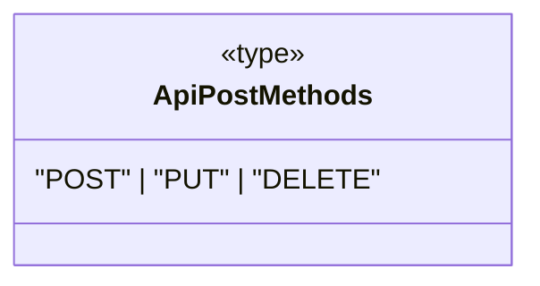

#### API-интерфейсы: `IApi`, `IOrderData` и `IPurchaseData`

##### `IApi`

Определяет наличие у реализующих и использующих в рамках композиции его сущностей, в частности, констуктора специализированного класса `larekAPI`, следующих API-методов:

- `get()` - типизированного метода запроса на получение данных, который принимает адрес `uri` и возвращает типизированный промис ответа
- `post()` - типизированного метода запроса на внесение изменений (`POST` | `PUT`) или удаление (`DELETE`) данных, который принимает адрес `uri`, объект передаваемых данных `data`, тип метода запроса `method`, а возвращает типизированный промис ответа

```ts
interface IApi {
  get<T extends object>(uri: string): Promise<T>;
  post<T extends object>(
    uri: string,
    data: object,
    method?: ApiPostMethods
  ): Promise<T>;
}
```

Представление `IApi` на UML-диаграмме

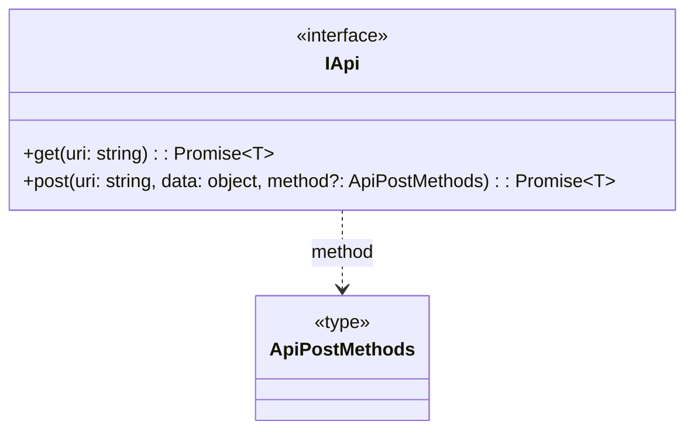

##### `ILarekProducts` - тип успешного ответа сервера на запрос списка товаров

```ts
interface ILarekProducts {
  total: number; // количество товаров
  items: IProduct[]; // массив товаров типа IProduct
}
```

Представление `ILarekProducts` на UML-диаграмме

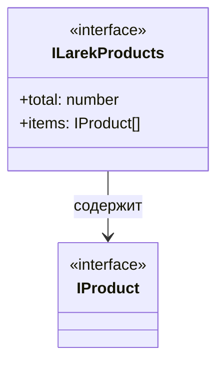

##### `IOrderData` - тип данных, передаваемых в теле запроса при оформлении заказа (покупки)

`IOrderData` расширяет `IBuyer`, добавяя к его свойствам стоимость `total` товаров в корзине и массив их идентификаторов `items`:

```ts
interface IOrderData extends IBuyer {
  total: Price; // стоимость товаров в корзине
  items: UUID[]; // массив идентификаторов товаров в корзине
}
```

Представление `IOrderData` на UML-диаграмме

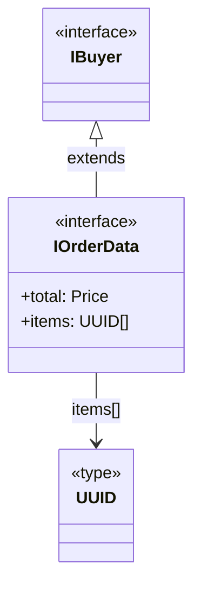

##### `IPurchaseData` - тип ответа сервера при успешном оформлении заказа (покупке)

```ts
interface IPurchaseData {
  id: UUID[]; // идентификатор зарегистрированного заказа
  total: Price; // стоимость покупки
}
```

Представление `IPurchaseData` на UML-диаграмме

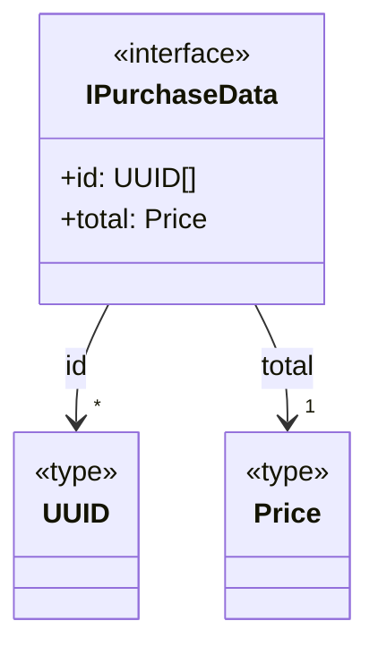

#### Базовые типы для работы со списками и заказом

##### `UUID` - тип, определяющий формат уникального ключа товара по стандарту Universally Unique Identifier

```ts
type UUID = `${string}-${string}-${string}-${string}-${string}`;
```

##### `Price` - стоимость товара

```ts
type Price = number;
```

##### `TPayment` - способ оплаты

```ts
type TPayment = "online" | "cash" | undefined;
```

Представление базовых типов для работы со списками и заказом на UML-диаграмме

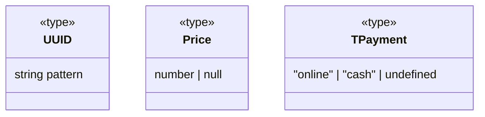

#### Товар - `IProduct`

Описывает главную сущность - товар, обладающий следующими свойствами:

```ts
interface IProduct {
  readonly id: UUID; // уникальный идентификатор товара типа `UUID` (не должен изменяться)
  description: string; // описание товара
  image: string; // завершающий фрагмент пути к файлу картинки товара
  title: string; // название товара
  category: string; // категория товара (допускается только одна)
  price: Price; // цена (null для непродаваемых товаров)
}
```

Представление `IProduct` на UML-диаграмме

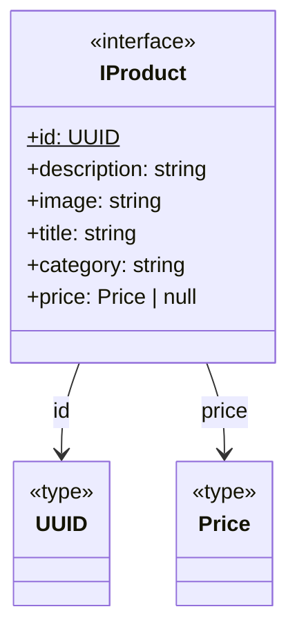

#### Каталог товаров - `ICatalog`

`ICatalog` разработан для описания типа универсального переиспользуемого хранилища объектов типа `T`. Он определяет следующие методы и свойства:

```ts
interface ICatalog<T> {
  items: T[]; // массив хранимых объектов типа T
  size: number; // количество объектов в каталоге
  selectedItem: T | undefined; // объект, выбранный для подробного отображения (undefined - если не выбран)
  addItem(item: T): void; // метод добавления в каталог объекта `item` типа T
  addItems(items: T[]): void; // метод добавления в каталог массива items объектов типа T
  getItemByKey(id: UUID): T | undefined; // метод вывода из каталога объекта типа T по его идентификатору id типа UUID
  removeItemByKey(id: UUID): boolean; // метод удаления из каталога объекта по его ключу id типа UUID
  clear(): void; // метод очистки каталога (в процессе очистки сбрасывает selectedItem в undefined)
  hasItem(id: UUID): boolean; // метод проверки наличия объекта в каталоге по его ключу id типа UUID
}
```

`ICatalog` на UML-диаграмме:

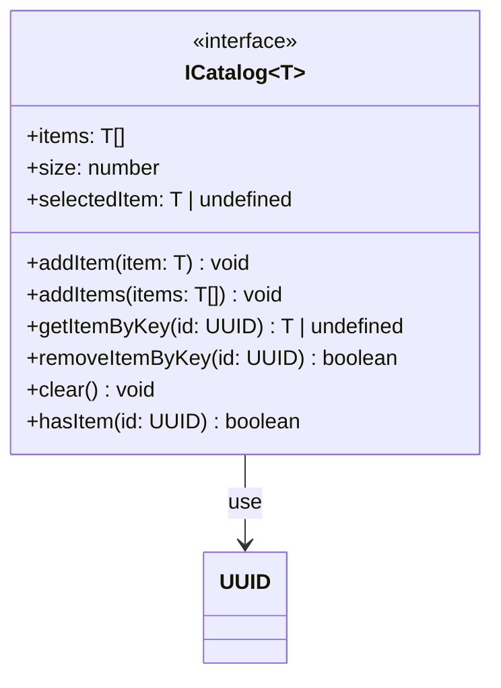

#### Корзина товаров - `IBasket`

Учитывая, что корзина товаров - это хранилище объектов, имеющих цену, `IBasket` построен на generic-типе `T`, расширяющем объект, имеющий свойство `price` типа `Price`. С другой стороны, свойства и функционал корзины товаров аналогичен каталогу товаров, поэтому целессобразно `IBasket` сделать типом, расширяющим `ICatalog`. `IBasket` добавляет к `ICatalog` следующие свойства и методы:

```ts
interface IBasket<T> extends ICatalog<T> {
  total: Price; // стоимость корзины типа Price
  order: Omit<IOrderData, keyof IBuyer>; // данные корзины, отправляемые в теле запроса на оформление заказа
  addItemByKey(id: UUID): void; // метод добавления товара в корзину
  delItem(id: UUID): void; // метод удаления товара из корзины
  getItemsIds(): UUID[]; // массива идентификаторов товаров в корзине
}
```

`IBasket` на UML-диаграмме:

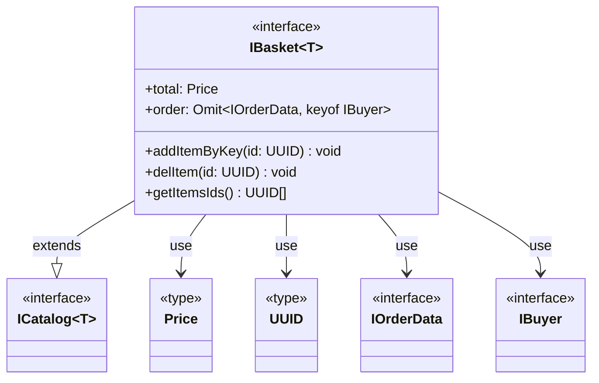

#### Покупатель - `IBuyer`

Описывает данные заказчика (покупателя):

```ts
interface IBuyer {
  payment: TPayment; // способ оплаты типа TPayment
  email: string; // email
  phone: string; // номер телефона
  address: string; // адрес
  readonly data?: Omit<IBuyer, "data">; // данные IBuyer в виде объекта
}
```

Свойство `data` построено на базе утилитарного типа `Omit`, определяющего на основе `IBuyer` тип, имеющий все его типизированные свойства за исключением `data`.

Представление `IBuyer` на UML-диаграмме

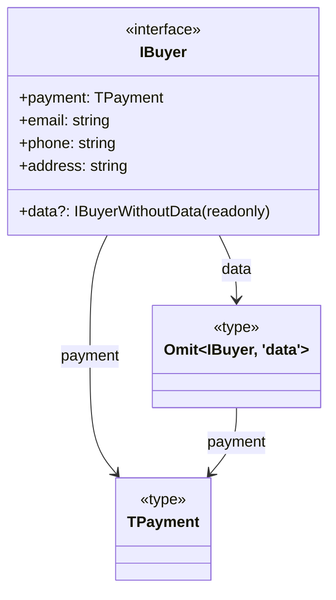

### Модели данных (`Model`)

#### КАТАЛОГ ПРОДУКТОВ - `Catalog`

##### Назначение

Разработан для описания функционала универсального переиспользуемого хранилища объектов типа `T`, имеющих readonly-свойство `id` типа `UUID` - уникальный ключ для CRUD-операций с данными хранилища (каталога товаров).

##### Реализация

Реализует методы и свойства `ICatalog`, созданные для работы с объектами типа `T`, имеющими уникальный ключ `id` типа `UUID`.

##### Конструктор

Опционально принимает массив `items` объектов типа `T` (товаров, если `T` = `IProduct`) и сохраняет его в защищенном поле `_items` в виде Map-коллекции объектов типа `T` с ключом типа `UUID`. Если `items` не определен, то создается пустая Map-коллекции.

```ts
  constructor(items?: T[]) {
    this._items = new Map<UUID, T>();
    if (items?.length) {
      this.items = items;
    }
  }
```

##### Поля

- `_items` - защищенное свойство, хранящее объекты (товары) каталога, в виде Map-коллекции объектов типа `T` с ключом типа `UUID`.

- `_selectedItem` - защищенное свойство, хранящее объект, выбранный из каталога (в т.ч. для подробного отображения).

```ts
  protected _items: Map<UUID, T>; // коллекция объектов
  protected _selectedItem?: T; // объект, выбранный из каталога
```

##### Методы

- добавление объекта типа `T` в каталог

  ```ts
    public addItem(item: T): void {
      this._items.set(item.id, item);
    }
  ```

- добавление массива объектов типа `T` в каталог

  ```ts
    public addItems(items: T[]): void {
      for (const item of items) {
        this.addItem(item);
      }
    }
  ```

- получение из каталога объекта типа `T` по его ключу `id` типа `UUID` (если не найден - возращает `undefined`)

  ```ts
    public getItemByKey(id: UUID): T | undefined {
      return this._items.get(id);
    }
  ```

- очистка каталога и сброс выбранного объекта в `undefined`

  ```ts
    public clear(): void {
      this.selectedItem = undefined; // сброс выбранного объекта
      this._items.clear(); // очистка каталога
    }
  ```

- получение количества объектов в каталоге

  ```ts
    get size(): number {
      return this._items.size;
    }
  ```

- удаление объекта из каталога по его ключу `id` типа `UUID` (возвращает `boolean`: `true` - успешно, `false` - нет)

  ```ts
    public removeItemByKey(id: UUID): boolean {
      return this._items.delete(id);
    }
  ```

- получение массива объектов типа `T`, хранимых в каталоге,

  ```ts
    get items(): T[] {
      return Array.from(this._items.values());
    }
  ```

- сохранение массива `items` объектов типа `T` (перед сохранением выполняется очистка каталога и сброс выбранного объекта в `undefined`)

  ```ts
    set items(items: T[]) {
      this.clear();
      for (const item of items) {
        this.addItem(item);
      }
    }
  ```

- проверка наличия объекта в каталоге по его ключу `id` типа `UUID` (возвращает `boolean`: `true` - найден, `false` - нет)

  ```ts
    public hasItem(id: UUID): boolean {
      return this._items.has(id);
    }
  ```

- сохранение выбранного объекта по его ключу `id` типа `UUID` (перед сохранением проверяется наличие в каталоге объекта с заданным ключом)

  ```ts
    set selectedItem(id: UUID | undefined) {
      if (id && this.hasItem(id)) this._selectedItem = this.getItemByKey(id);
      else this._selectedItem = undefined;
    }
  ```

- получение выбранного объекта типа `T` (если объект не определен, то возвращается `undefined`)

  ```ts
    get selectedItem(): T | undefined {
      return this._selectedItem;
    }
  ```

##### UML-диаграмма

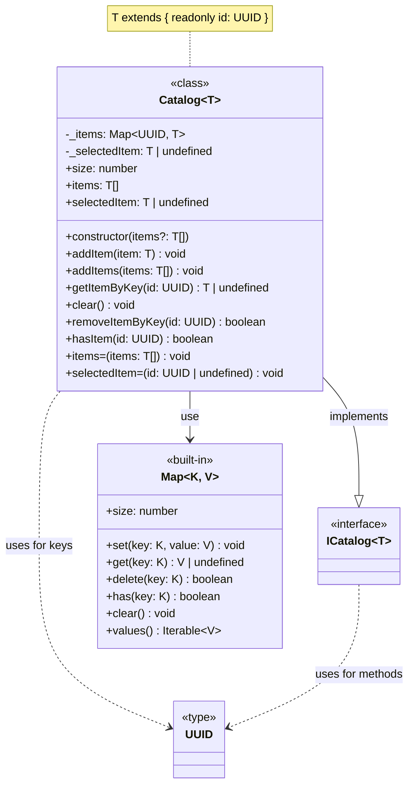

#### КОРЗИНА ПРОДУКТОВ - `Basket`

##### Назначение

Разработан для описания функционала работы с корзиной объектов (товаров) типа `T`, выбранных из каталога. Объекты должны иметь:

- readonly-свойство `id` типа `UUID` - уникальный ключ для CRUD-операций с данными корзины;
- свойство `price` типа `Price` - цену объекта

##### Реализация

Расширяет `Basket` и реализует `IBasket`.

##### Конструктор

Вызывает конструктор родительского (расширяемого) специализированного класса `Catalog` для создания и последующих операций с хранилищем отобранных в корзину объектов (товаров). Принимает и сохраняет в защищенное поле `_catalog` экземпляр `catalog` каталога товаров типа `ICatalog`, из которого в дальнейшем выбираются товары в корзину.

```ts
  constructor(catalog: ICatalog<T>) {
    super();
    this._catalog = catalog;
  }
```

##### Поля

- защищенное поле `_catalog` - экземпляр каталога товаров типа `ICatalog`, из которого выбираются товары в корзину.

##### Методы

- `total` - получение расчетной стоимости корзины типа `Price`:

  ```ts
  get total(): Price {
    return this.items.reduce(
      (cost, item) => item.price ? cost + item.price : cost,
      0)
  }
  ```

  Для исключения потенциальных runtime-ошибок перед расчетом стоимости выполняется отсев объектов с null-ценой.

- `addItemByKey` - добавление объекта (товара) из каталога в в корзину по его ключу `id` типа `UUID`. Перед добавлением в корзину по заданному ключу `id` проверяется наличие объекта (товара) в каталоге `_catalog`. Добавляемый товар также должен иметь цену (значение свойства `price` не должно быть `null`).

  ```ts
  public addItemByKey(id: UUID): void {
    const item = this._catalog.getItemByKey(id);
    if (item && item.price) this.addItem(item);
  }
  ```

- `delItem` - удаление из корзины объекта (товара) с указанным ключом `id` типа `UUID`. Перед удалением проверяется его наличие в корзине:

  ```ts
  public delItem(id: UUID): void {
    if (this.hasItem(id)) this.removeItemByKey(id);
  }
  ```

- `getItemsIds` - получение массива ключей объектов (товаров) типа `UUID`, хранимых в корзине:

  ```ts
  getItemsIds(): UUID[] {
    return this.items.map(item => item.id)
  }
  ```

- `order` - получение данных корзины для оформления заказа:

  ```ts
  get order(): Omit<IOrderData, keyof IBuyer> {
    return {
      total: this.total, // стоимость товаров в корзине
      items: this.getItemsIds(), // массив идентификаторов товаров в корзине
    }
  }
  ```

Для определения типа возвращаемого геттером `order` значения используется утилитарный тип `Omit`, который выбирает из `IOrderData` все свойства и их типы за исключением тех, что определены `IBuyer`:

- `total` - стоимость товаров в корзине типа `Price`
- `items` - массив идентификаторов товаров в корзине типа `UUID`.

##### UML-диаграмма

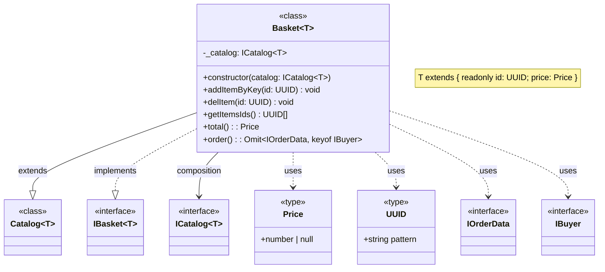

#### ПОКУПАТЕЛЬ - `Buyer`

##### Назначение

Описывает работу с данными покупателя.

##### Реализация

Реализует `IBuyer`.

##### Конструктор

С помощью утилитарного типа `Partial` опционально могут определены все или часть свойств покупетля.

```ts
  constructor(buyer?: Partial<IBuyer>) {
    if (buyer) {
      if (buyer.payment) this.payment = buyer.payment;
      if (buyer.email) this.email = buyer.email;
      if (buyer.phone) this.phone = buyer.phone;
      if (buyer.address) this.address = buyer.address;
    }
  }
```

##### Поля

Все поля - защищенные.

- `_payment` - способ оплатиы типа `TPayment` (по умолчанию - `undefined`)
- `_email` - электронная почта типа `string`
- `_phone` - телефон типа `string`
- `_address` - адрес типа `string`

```ts
  protected _payment: TPayment = undefined;
  protected _email: string = '';
  protected _phone: string = '';
  protected _address: string = '';
```

##### Методы

- методы получения и определения свойств покупателя:

  - для каждого отдельного свойства покупателя определены геттеры и сеттеры, принимающие и возвращающие данные соответствующих типов:

    ```ts
    set payment(payment: TPayment) {
      this._payment = payment;
    }

    get payment() {
      return this._payment;
    }

    set email(email: string) {
      this._email = email;
    }

    get email() {
      return this._email;
    }

    set phone(phone: string) {
      this._phone = phone;
    }

    get phone() {
      return this._phone;
    }

    set address(address: string) {
      this._address = address;
    }

    get address() {
      return this._address;
    }
    ```

  - получение данных корзины для оформления заказа (покупки) - все полей `Buyer` в виде объекта:

    ```ts
    get data(): Omit<IBuyer, 'data'> {
      return {
        payment: this._payment,
        email: this._email,
        phone: this._phone,
        address: this._address
      }
    }
    ```

    Утилитарный класс `Omit`используется для исключения геттера `data` из `IBuyer`.

- `clear` - очистка всех полей экземпляра `Buyer` путем сброса к их начальным значениям:

  ```ts
    public clear() {
      this.#payment = undefined;
      this.#email = '';
      this.#phone = '';
      this.#address = '';
    }
  ```

- методы проверки валидности каждого отдельного и всех одновременно свойств покупателя (возвращают: `true` - если значение валидное, `false` - если нет):

  ```ts
  public isEmailValid(): boolean {
    return this._email.trim().length > 0;
  }

  public isPhoneValid(): boolean {
    return this._phone.trim().length > 0;
  }

  public isAddressValid(): boolean {
    return this._address.trim().length > 0;
  }

  public isPaymentValid(): boolean {
    return !!(this.payment);
  }

  public isAllValid(): boolean {
    return (
      this.isPaymentValid() &&
      this.isEmailValid() &&
      this.isPhoneValid() &&
      this.isAddressValid()
    )
  }
  ```

  Перед проверкой у всех строковых полей удаляются начальные и завершающие пробелы. Валидация всех полей методом `isAllValid` выполняется на основе методов проверки валидности каждого из полей `Buyer`.

##### UML-диаграмма

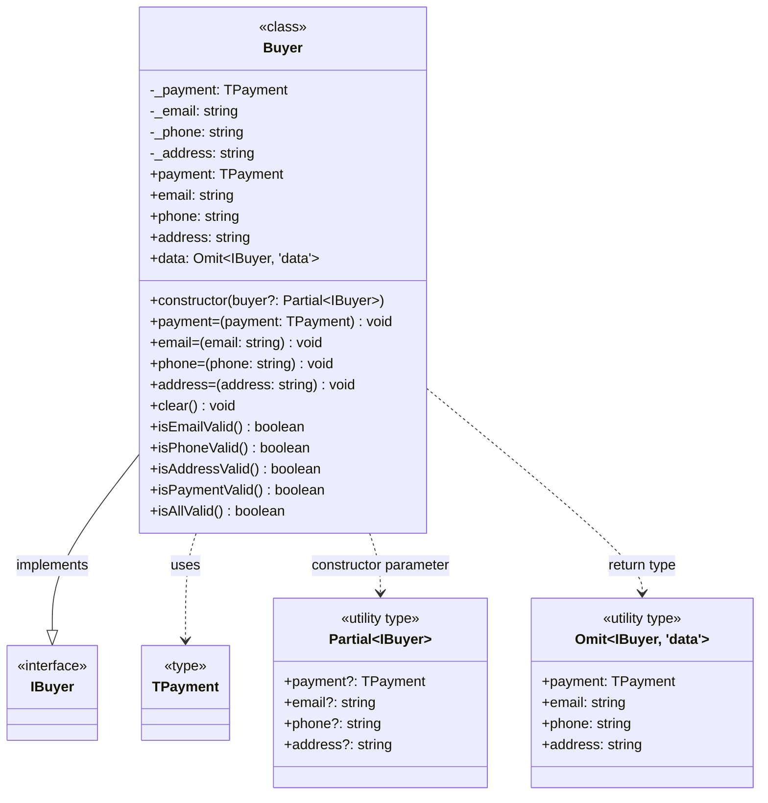

### Коммуникационный слой

#### API WEBLAREK - `LarekAPI`

##### Назначение

Специализированный класс для работы с запросами API WEBLAREK (работа с товарами).  
Позволяет запросить данные для каталога товаров и оформить (зарегистрировать) заказ (покупку).

##### Реализация

Реализует композицию объектов типов `IApi`, `IBasket`, `IBuyer` и собственные методы на его основе.

##### Конструктор

Принимает объекты типов `IApi`, `IBasket`, `IBuyer` и сохраняет ссылки на них в защищенных полях `_api`, `_basket` и  `_buyer`, соответственно:

```ts
  constructor(api: IApi, basket: IBasket<IProduct>, buyer: IBuyer) {
    this._api = api;
    this._basket = basket;
    this._buyer = buyer;
  }
```

##### Поля

- `_api` - ссылка на объект типа `IApi`, реализующий универсальные методы запроса данных.
- `_basket` - ссылка на объект типа `IBasket`, позволяющий получить данные о корзине товаров типа `IProduct`
- `_buyer` - ссылка на объект типа `IBuyer`, позволяющий получить данные о покупателе типа `IBuyer`

  ```ts
  protected _api: IApi;
  protected _basket: IBasket<IProduct>;
  protected _buyer: IBuyer;
  ```

##### Методы

- `getShopProducts` - метод get-запроса массива товаров для отображения в каталоге:

  ```ts
  public getShopProducts(): Promise<ILarekProducts> {
    return this._api.get<ILarekProducts>(URI_PRODUCTS);
  }
  ```

  В случае успеха `getShopProducts` возврает промис данных типа `ILarekProducts`, в противном случае - данные об ошибке типа `Response`

- `placeOrder` - метод post-запроса на оформление заказа (покупки), передающий в его теле объект типа `IOrderData` с данными о заказе.  

  ```ts
  placeOrder(): Promise<IPurchaseData> {
    return this._api.post<IPurchaseData>(
      URI_ORDER,
      this.orderData,
      'POST' 
    );
  }
  ```

  Объект с данными о заказе формируется геттером `orderData`. В случае успеха данный метод возврает промис с данными о регистрации заказа (покупке) типа `IPurchaseData` или данными об ошибке типа `Response`.

- `orderData` - метод, формирующий на основе данных корзины (`_basket`) и покупателя (`_buyer`) объект данных типа `IOrderData`, отправляемый в теле post-запроса на оформление заказа (покупки).

  ```ts
  get orderData(): IOrderData {
    return {
      ...this._buyer.data,
      ...this._basket.order,
    } as IOrderData;
  }
  ```

##### UML-диаграмма

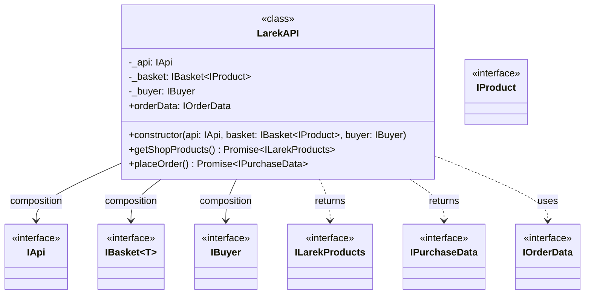

### UML-диаграмма приложения

```mermaid
classDiagram
    class ApiPostMethods {
        <<type>>
        "POST" | "PUT" | "DELETE"
    }

    class IApi {
        <<interface>>
        +get<T>(uri: string): Promise~T~
        +post<T>(uri: string, data: object, method?: ApiPostMethods): Promise~T~
    }

    class ILarekProducts {
        <<interface>>
        +total: number
        +items: IProduct[]
    }

    class IProduct {
        <<interface>>
        +id: UUID$
        +description: string
        +image: string
        +title: string
        +category: string
        +price: Price | null
    }

    class IOrderData {
        <<interface>>
        +total: Price
        +items: UUID[]
    }

    class IBuyer {
        <<interface>>
        +payment: TPayment
        +email: string
        +phone: string
        +address: string
        +data?: IBuyerWithoutData (readonly)
    }

    class UUID {
        <<type>>
        string pattern
    }

    class IPurchaseData {
        <<interface>>
        +id: UUID[]
        +total: Price
    }

    class Price {
        <<type>>
        number  | null
    }

    class TPayment {
        <<type>>
        "online" | "cash" | undefined
    }

    class ICatalog~T~ {
        <<interface>>
        +items: T[]
        +size: number
        +selectedItem: T | undefined
        +addItem(item: T) void
        +addItems(items: T[]) void
        +getItemByKey(id: UUID) T | undefined
        +removeItemByKey(id: UUID) boolean
        +clear() void
        +hasItem(id: UUID) boolean
    }

    class IBasket~T~ {
        <<interface>>
        +total: Price
        +order: Omit~IOrderData, keyof IBuyer~
        +addItemByKey(id: UUID) void
        +delItem(id: UUID) void
        +getItemsIds() UUID[]
    }

    class Omit~IBuyer, 'data'~ {
        <<type>>
    }

    class Catalog~T~ {
        <<class>>
        -_items: Map~UUID, T~
        -_selectedItem: T | undefined
        +constructor(items?: T[])
        +addItem(item: T) void
        +addItems(items: T[]) void
        +getItemByKey(id: UUID) T | undefined
        +clear() void
        +removeItemByKey(id: UUID) boolean
        +hasItem(id: UUID) boolean
        +size: number
        +items: T[]
        +items=(items: T[]) void
        +selectedItem: T | undefined
        +selectedItem=(id: UUID | undefined) void
    }

    class Map~K, V~ {
        <<built-in>>
        +set(key: K, value: V) void
        +get(key: K) V | undefined
        +delete(key: K) boolean
        +has(key: K) boolean
        +clear() void
        +size: number
        +values() Iterable~V~
    }

    class Basket~T~ {
        <<class>>
        -_catalog: ICatalog~T~
        +constructor(catalog: ICatalog~T~)
        +addItemByKey(id: UUID) void
        +delItem(id: UUID) void
        +getItemsIds() UUID[]
        +total(): Price
        +order(): Omit~IOrderData, keyof IBuyer~
    }

    class Buyer {
        <<class>>
        -_payment: TPayment
        -_email: string
        -_phone: string
        -_address: string
        +constructor(buyer?: Partial~IBuyer~)
        +payment: TPayment
        +payment=(payment: TPayment) void
        +email: string
        +email=(email: string) void
        +phone: string
        +phone=(phone: string) void
        +address: string
        +address=(address: string) void
        +data: Omit~IBuyer, 'data'~
        +clear() void
        +isEmailValid() boolean
        +isPhoneValid() boolean
        +isAddressValid() boolean
        +isPaymentValid() boolean
        +isAllValid() boolean
    }

    class Partial~IBuyer~ {
        <<utility type>>
        +payment?: TPayment
        +email?: string
        +phone?: string
        +address?: string
    }

    class Omit~IBuyer, 'data'~ {
        <<utility type>>
        +payment: TPayment
        +email: string
        +phone: string
        +address: string
    }

    class LarekAPI {
        <<class>>
        -_api: IApi
        -_basket: IBasket~IProduct~
        -_buyer: IBuyer
        +constructor(api: IApi, basket: IBasket~IProduct~, buyer: IBuyer)
        +getShopProducts() Promise~ILarekProducts~
        +placeOrder() Promise~IPurchaseData~
        +orderData: IOrderData
    }

    note for Catalog "T extends { readonly id: UUID }"
    note for Basket~T~ "T extends { readonly id: UUID; price: Price }"

    IApi ..> ApiPostMethods : method
    ILarekProducts --> IProduct : contains
    IPurchaseData --> "*" UUID : id
    IPurchaseData --> "1" Price : total
	IBuyer <|-- IOrderData : extends
    IOrderData --> UUID : items[]
	IProduct --> UUID : id
    IProduct --> Price : price
    ICatalog --> UUID : use
	IBasket --|> ICatalog : extends
    IBasket --> Price : use
    IBasket --> UUID : use
    IBasket --> IOrderData : use
    IBasket --> IBuyer : use
	IBuyer --> TPayment : payment
    IBuyer --> Omit~IBuyer, 'data'~ : data
    Omit~IBuyer, 'data'~ --> TPayment : payment
	Basket --|> Catalog : extends
    Basket ..|> IBasket : implements
    Basket --> ICatalog : composition
    Basket ..> Price : uses
    Basket ..> UUID : uses
    Basket ..> IOrderData : uses
    Basket ..> IBuyer : uses
	Buyer --|> IBuyer : implements
    Buyer ..> TPayment : uses
    Buyer ..> Partial~IBuyer~ : constructor parameter
    Buyer ..> Omit~IBuyer, 'data'~ : return type
	LarekAPI --> IApi : composition
    LarekAPI --> IBasket~IProduct~ : composition
    LarekAPI --> IBuyer : composition
    LarekAPI ..> ILarekProducts : returns
    LarekAPI ..> IPurchaseData : returns
    LarekAPI ..> IOrderData : uses
	Catalog --|> ICatalog : implements
    Catalog --> Map~UUID, T~ : use
    Catalog ..> UUID : uses for keys
    ICatalog ..> UUID : uses for methods
```
