// FIXME: Проверить все mermaid-диаграммы

# Проектная работа "Веб-ларек"

Стек: HTML, SCSS, TS, Webpack

Структура проекта:

- src/ — исходные файлы проекта
- src/components/ — папка с JS компонентами
- src/components/base/ — папка с базовым кодом

Важные файлы:

- index.html — HTML-файл главной страницы
- src/types/index.ts — файл с типами
- src/main.ts — точка входа приложения
- src/scss/styles.scss — корневой файл стилей
- src/utils/constants.ts — файл с константами
- src/utils/utils.ts — файл с утилитами

## Установка и запуск

Для установки и запуска проекта необходимо выполнить команды

```sh
npm install
npm run dev
```

или

```sh
yarn
yarn dev
```

## Сборка

```sh
npm run build
```

или

```sh
yarn build
```

# Интернет-магазин «Web-Larёk»

«Web-Larёk» — это интернет-магазин с товарами для веб-разработчиков, где пользователи могут просматривать товары, добавлять их в корзину и оформлять заказы. Сайт предоставляет удобный интерфейс с модальными окнами для просмотра деталей товаров, управления корзиной и выбора способа оплаты, обеспечивая полный цикл покупки с отправкой заказов на сервер.

## Архитектура приложения

Код приложения разделен на слои согласно парадигме `MVP` (`Model-View-Presenter`), которая обеспечивает четкое разделение ответственности между классами слоев `Model` и `View`. Каждый слой несет свой смысл и ответственность:

`Model` - слой данных, отвечает за хранение и изменение данных.  
`View` - слой представления, отвечает за отображение данных на странице.  
`Presenter` - презентер содержит основную логику приложения и отвечает за связь представления и данных.

Взаимодействие между классами обеспечивается использованием событийно-ориентированного подхода. Модели и Представления генерируют события при изменении данных или взаимодействии пользователя с приложением, а Презентер обрабатывает эти события используя методы как Моделей, так и Представлений.

### Базовый код

#### Класс Component

Является базовым классом для всех компонентов интерфейса.
Класс является дженериком и принимает в переменной `T` тип данных, которые могут быть переданы в метод `render` для отображения.

Конструктор:  
`constructor(container: HTMLElement)` - принимает ссылку на DOM элемент за отображение, которого он отвечает.

Поля класса:  
`container: HTMLElement` - поле для хранения корневого DOM элемента компонента.

Методы класса:  
`render(data?: Partial<T>): HTMLElement` - Главный метод класса. Он принимает данные, которые необходимо отобразить в интерфейсе, записывает эти данные в поля класса и возвращает ссылку на DOM-элемент. Предполагается, что в классах, которые будут наследоваться от `Component` будут реализованы сеттеры для полей с данными, которые будут вызываться в момент вызова `render` и записывать данные в необходимые DOM элементы.  
`setImage(element: HTMLImageElement, src: string, alt?: string): void` - утилитарный метод для модификации DOM-элементов ``

#### Класс Api

Содержит в себе базовую логику отправки запросов.

Конструктор:  
`constructor(baseUrl: string, options: RequestInit = {})` - В конструктор передается базовый адрес сервера и опциональный объект с заголовками запросов.

Поля класса:  
`baseUrl: string` - базовый адрес сервера  
`options: RequestInit` - объект с заголовками, которые будут использованы для запросов.

Методы:  
`get(uri: string): Promise<object>` - выполняет GET запрос на переданный в параметрах ендпоинт и возвращает промис с объектом, которым ответил сервер  
`post(uri: string, data: object, method: ApiPostMethods = 'POST'): Promise<object>` - принимает объект с данными, которые будут переданы в JSON в теле запроса, и отправляет эти данные на ендпоинт переданный как параметр при вызове метода. По умолчанию выполняется `POST` запрос, но метод запроса может быть переопределен заданием третьего параметра при вызове.  
`handleResponse(response: Response): Promise<object>` - защищенный метод проверяющий ответ сервера на корректность и возвращающий объект с данными полученный от сервера или отклоненный промис, в случае некорректных данных.

#### Класс EventEmitter

Брокер событий реализует паттерн "Наблюдатель", позволяющий отправлять события и подписываться на события, происходящие в системе. Класс используется для связи слоя данных и представления.

Конструктор класса не принимает параметров.

Поля класса:  
`_events: Map<string | RegExp, Set<Function>>)` - хранит коллекцию подписок на события. Ключи коллекции - названия событий или регулярное выражение, значения - коллекция функций обработчиков, которые будут вызваны при срабатывании события.

Методы класса:  
`on<T extends object>(event: EventName, callback: (data: T) => void): void` - подписка на событие, принимает название события и функцию обработчик.  
`emit<T extends object>(event: string, data?: T): void` - инициализация события. При вызове события в метод передается название события и объект с данными, который будет использован как аргумент для вызова обработчика.  
`trigger<T extends object>(event: string, context?: Partial<T>): (data: T) => void` - возвращает функцию, при вызове которой инициализируется требуемое в параметрах событие с передачей в него данных из второго параметра.

### Данные

#### Типы медотов API-запросов - `ApiPostMethods`

Предназначен для обеспечения типизации методов API-запросов.

```ts
type ApiPostMethods = "POST" | "PUT" | "DELETE";
```

Представление `IApi` и `ApiPostMethods` на UML-диаграмме

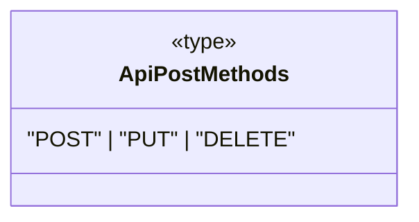

#### API-интерфейсы: `IApi`, `ILarekProducts`, `IOrderData` и `IPurchaseData`

##### `IApi`

Определяет наличие у реализующих и использующих в рамках композиции его сущностей, в частности, констуктора специализированного класса `larekAPI`, следующих API-методов:

- `get()` - типизированного метода запроса на получение данных, который принимает адрес `uri` и возвращает типизированный промис ответа
- `post()` - типизированного метода запроса на внесение изменений (`POST` | `PUT`) или удаление (`DELETE`) данных, который принимает адрес `uri`, объект передаваемых данных `data`, тип метода запроса `method`, а возвращает типизированный промис ответа

```ts
interface IApi {
  get<T extends object>(uri: string): Promise<T>;
  post<T extends object>(
    uri: string,
    data: object,
    method?: ApiPostMethods
  ): Promise<T>;
}
```

Представление `IApi` на UML-диаграмме

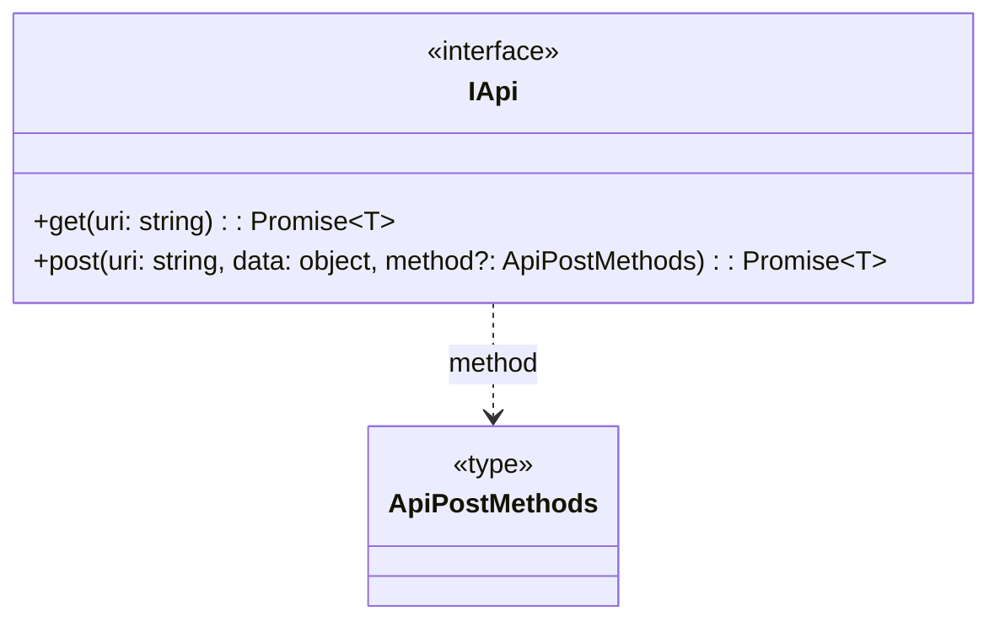

##### `ILarekProducts` - тип успешного ответа сервера на запрос списка товаров

```ts
interface ILarekProducts {
  total: number; // количество товаров
  items: IProduct[]; // массив товаров типа IProduct
}
```

Представление `ILarekProducts` на UML-диаграмме

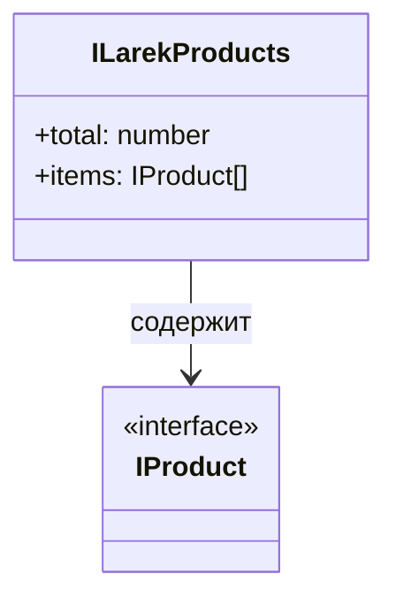

##### `IOrderData` - тип данных, передаваемых в теле запроса при оформлении заказа (покупке)

```ts
interface IOrderData extends IBuyer {
  total: Price; // стоимость товаров в корзине
  items: UUID[]; // массив идентификаторов товаров в корзине
}
```

Представление `IOrderData` на UML-диаграмме

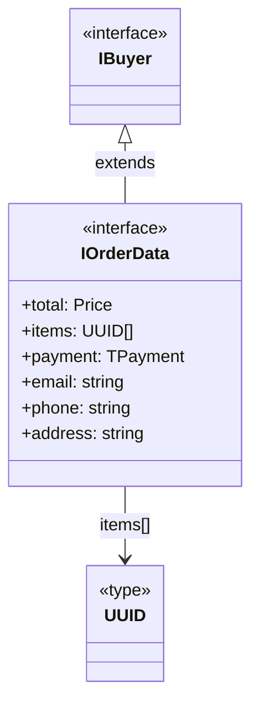

##### `IPurchaseData` - тип ответа сервера при успешном оформлении заказа (покупке)

```ts
interface IPurchaseData {
  id: UUID[]; // идентификатор заказа
  total: Price; // стоимость покупки
}
```

Представление `IPurchaseData` на UML-диаграмме

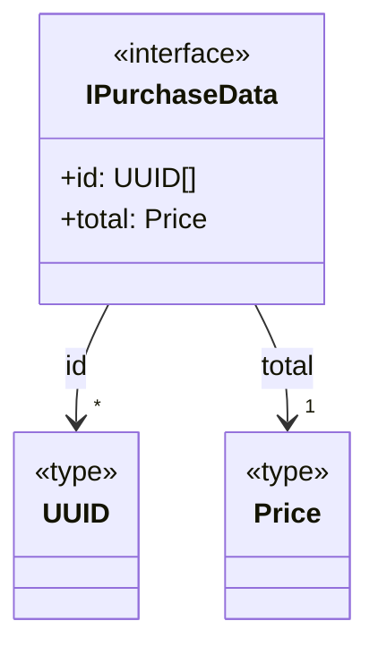

#### Базовые типы для работы со списками и заказом

##### `IdType` - тип уникального ключа товара

Ключом может выступать любое свойство элемента списка, хранящее уникальные значения (для товара - `id`).

```ts
type IdType = typeof ID_NAME; // ID_NAME - ключ-свойство товара
```

##### `UUID` - тип, определяющий структуру уникального ключа товара

```ts
type UUID = `${string}-${string}-${string}-${string}-${string}`;
```

##### `Price` - стоимость товара

```ts
type Price = number;
```

##### `TPayment` - способ оплаты

```ts
type TPayment = "online" | "cash" | undefined;
```

Представление базовых типов для работы со списками и заказом на UML-диаграмме

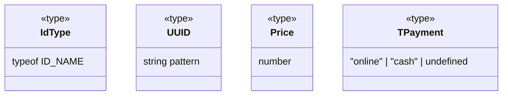

#### Товар - `IProduct`

Описывает основную абстракцию, товар, со следующими свойствами:

- `image` -
- `title` -
- `category` -
- `price` -

```ts
interface IProduct {
  readonly id: UUID; // уникальный идентификатор товара типа `UUID` (не должен изменяться)
  description: string; // описание товара
  image: string; // фрагмент пути к файлу картинки товара
  title: string; // название товара
  category: string; // категория товара
  price: Price | null; // цена (null для непродаваемых товаров)
}
```

Представление `IProduct` на UML-диаграмме

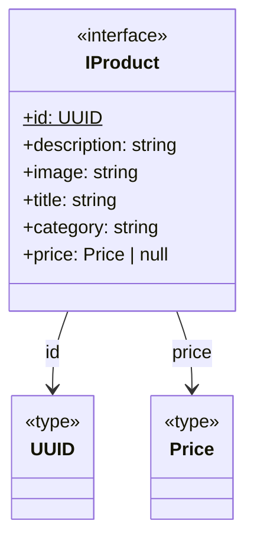

#### Универсальный список - `IList`

`IList` - интерфейс, описывающий абстрактный переиспользуемый список, построенный на основе Map-коллекции. На его основе созданы расширением специализированные интерфейсы каталога (`ICatalog`) и корзины (`IBasket`) со специфическими для этих сущностей свойствами и методами. Элементы списков каталога и корзины - товары, ключи - их уникальные идентификаторы. Обладает следующими свойствами и методами:

```ts
interface IList<T, Key extends keyof T> {
  items: T[]; // массив элементов списка
  size: number; // количество элементов в списке
  addItem(item: T): void; // метод добавления элемента в список
  addItems(items: readonly T[]): void; // метод добавления массива элементов в список
  getItemByKey(key: T[Key]): T | undefined; // метод вывода элемента из списка по его ключу
  removeByKey(key: T[Key]): boolean; // метод удаления элемента из списка по его ключу
  clear(): void; // метод очистки списка
  hasKey(key: T[Key]): boolean; // метод проверки наличия элемента в списке по его ключу
}
```

Представление `IList` на UML-диаграмме

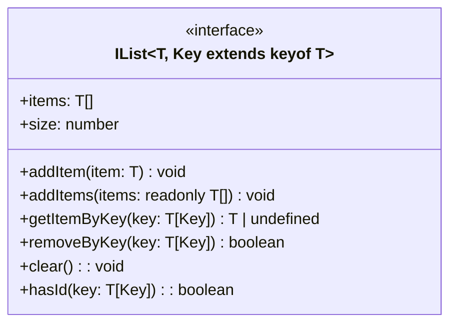

#### Каталог товаров - `ICatalog`

`ICatalog` определяет методы и свойства каталога товаров, расширяя и специализируя `IList` с помощью:

- `IProduct`, определяющего тип хранимых в списке элементов как товар
- `'id'`, определяющего имя свойства `IProduct` как ключ для работы со списком (каталогом).

`ICatalog` расширяет `IList` следующими свойствами и методом:

```ts
interface ICatalog extends IList<IProduct, IdType> {
  products: IProduct[]; // список (массив) товаров каталога
  preview: IProduct | undefined; // товар, выбранный для подробного отображения
  getProductById(productId: UUID): IProduct | undefined; // метод получения товара по идентификатору
}
```

`ICatalog` на UML-диаграмме:

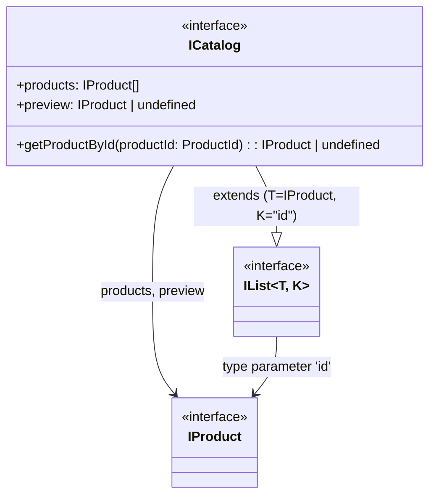

#### Корзина товаров - `IBasket`

`IBasket` аналогично `ICatalog` расширяет и специализирует `IList`, аналогично `ICatalog`. Он добавляет к `IList` следующие свойства и методы:

- `hasProduct(productId: ProductId): boolean` - метод проверки наличия товара в корзине по его идентификатору, являющийся оберткой метода `hasKey()` интерфейса `IList`

```ts
interface IBasket extends IList<IProduct, IdType> {
  products: IProduct[]; // список товаров в корзине
  total: Price; // стоимость корзины
  countProducts: number; // количество товаров в корзине
  addProduct(productId: UUID): void; // метод добавления товара в корзину по его идентифмкатору productId
  delProduct(productId: UUID): void; // метод удаления товара из корзины по его идентифмкатору productId
  clear(): void; // метод очистки корзины
  hasProduct(productId: UUID): boolean; // метод проверки наличия товара в корзине по его идентикатору
  getProductsId(): UUID[]; // метод получения массива идентификаторов товаров корзины
}
```

`IBasket` на UML-диаграмме:

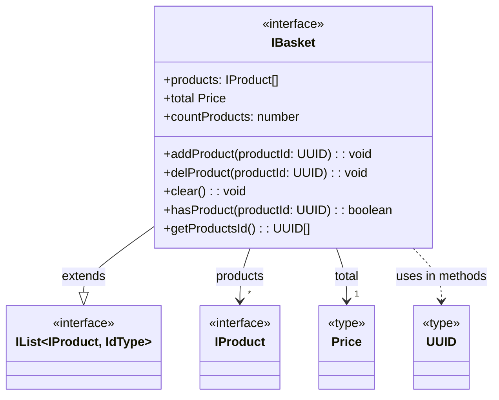

#### Покупатель - `IBuyer`

Описывает данные заказчика (покупателя):

```ts
interface IBuyer {
  payment: TPayment; // способ оплаты
  email: string; // email
  phone: string; // номер телефона
  address: string; // адрес
}
```

Представление `IBuyer` на UML-диаграмме

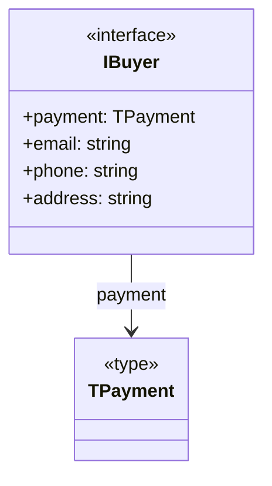

#### Заказ (покупка) - `IOrder`

Интегрирует данные корзины и покупателя для описания ключевой сущности - ЗАКАЗ.  
Используется для описания типа данных, формируемых для отправки (оформления/регистрации) заказа.

```ts
interface IOrder {
  orderData: IOrderData; // метод формирования данных для запроса оформления покупки
}
```

### Модели данных (`Model`)

#### УНИВЕРСАЛЬНЫЙ СПИСОК - `List`

##### Назначение

Универсальный список, разработанный как список-прототип для списков товаров каталога и корзины. Объединяет свойства и методы абстрактного списка-прототипа.

##### Реализация

Основана на Map-коллекции объектов типа `T` с ключом `key`, обеспечивающая уникальность хранимых объектов списка по заданному ключу. Реализует `IList`.

##### Конструктор

Cоздает экзепляр списка объектов типа `T` с ключом `key`. Опционально может быть задан стартовый массив объектов `items` типа `T`.

```ts
  constructor(key: Key, items?: readonly T[]) {
    this._key = key;
    this._items = new Map<T[Key], T>();
    if (items?.length) {
      this.addItems(items);
    }
  }
```

##### Поля

Все поля класса созданы приватными:

```ts
  private _items: Map<T[Key], T>;
  private _key: Key;
```

- `_items` - хранилище объектов списка типа `T`, реализованное в виде Map-коллекции объектов типа `T` c ключом `key`.

- `_key` - ключ Map-коллеции, являющийся одним из свойств объектов типа `T`.

##### Методы

- `addItem` - добавление объекта типа `T` в список

  ```ts
  public addItem(item: T): void {
      this._items.set(item[this._key], item);
  }
  ```

- `addItems` - добавление массива элементов типа `T` в список

  ```ts
  public addItems(items: readonly T[]): void {
    for (const item of items) {
      this.addItem(item);
    }
  }
  ```

- `getItemByKey` - получение объекта типа `T` списка по его ключу `key`. Если объекта в списке нет, то возвращает `undefined`.

  ```ts
  public getItemByKey(key: T[Key]): T | undefined {
    return this._items.get(key);
  }
  ```

- `clear` - очистка списка

  ```ts
  public clear(): void {
    this._items.clear();
  }
  ```

- `size` - получение количества объектов (типа `number`) в списке

  ```ts
  get size(): number {
    return this._items.size;
  }
  ```

- `removeByKey` - удаление объекта типа `T` из списка по его ключу `key`. Возврщает `true`, если объект успешно удален, и `false`- если нет.

  ```ts
  public removeByKey(key: T[Key]): boolean {
    return this._items.delete(key);
  }
  ```

- `items` - получение массива объектов типа `T` списка

  ```ts
  get items(): T[] {
    return Array.from(this._items.values());
  }
  ```

- `hasKey` - проверка наличия объекта типа `T` в списке по его ключу `key`

  ```ts
  public hasKey(key: T[Key]): boolean {
    return this._items.has(key);
  }
  ```

##### UML-диаграмма

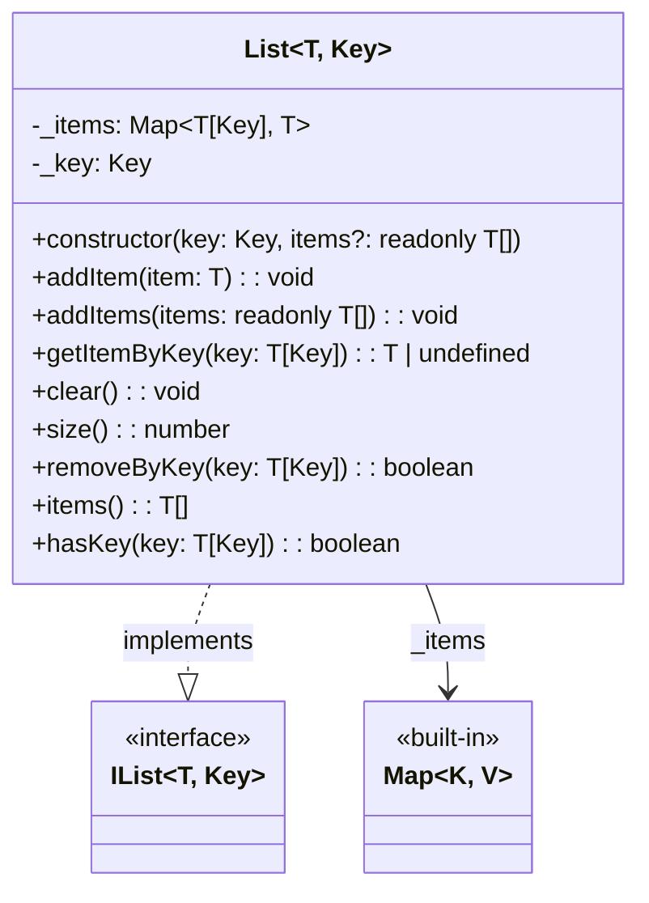

#### АБСТРАКТНЫЙ СПИСОК ТОВАРОВ - `ProductsList`

##### Назначение

Абстрактный класс, являющийся специализацией (расширением) класса `List` для работы с различными списками товаров, описываемых `IProduct`.

##### Реализация

Разработан на основе `IProduct` для устранения дублирования (переиспользованием) общих свойств и методов в производных классах списков товаров (`Catalog` и `Basket`).

##### Конструктор

Принимает ключ товара (по умолчанию - `ID_NAME='id'`), являющийся свойством `IProduct`, и передает его родительскому (расширяемому) классу `List`:

```ts
  constructor(key: keyof IProduct = ID_NAME) {
    super(key);
  }
```

##### Методы

- `products` - получение cписка товаров типа `IProduct[]`:

  ```ts
  get products(): IProduct[] {
    return this.items;
  }
  ```

- `products` - задание списка товаров, передаваемых сеттеру через параметр `products` типа `IProduct[]`:

  ```ts
  set products(products: IProduct[]) {
    this.addItems(products);
  }
  ```

##### UML-диаграмма

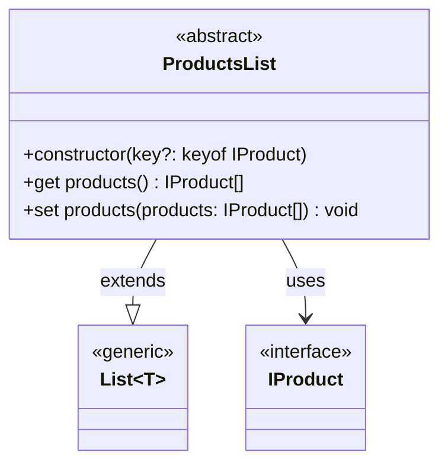

#### КАТАЛОГ ПРОДУКТОВ - `Catalog`

##### Назначение

Специализированный класс для работы с каталогом товаров.

##### Реализация

Расширяет `ProductsList` и реализует `ICatalog`.

##### Поля

- `#preview` - приватное поле типа `IProduct` (или `undefined`, если товар не выбран) для хранения товара, выбранного для подробного отображения:

```ts
  #preview: IProduct | undefined = undefined;
```

##### Методы

- `preview` - определение товара для подробного отображения на основе параметра сеттера `productId`, являющегося идентификатором товара типа `UUID`:

  ```ts
  set preview(productId: UUID) {
    this.#preview = this.getItemByKey(productId);
  }
  ```

- `preview` - получение товара типа `IProduct` для подробного отображения (если товар не выбран - `undefined`):

  ```ts
    get preview(): IProduct | undefined {
    return this.#preview;
  }
  ```

- `getProductById` - получение товара типа `IProduct` (или `undefined`, если он не выбран) по его идентификатору `productId` типа `UUID`:

  ```ts
  public getProductById(productId: UUID): IProduct | undefined {
    return this.getItemByKey(productId);
  }
  ```

##### UML-диаграмма

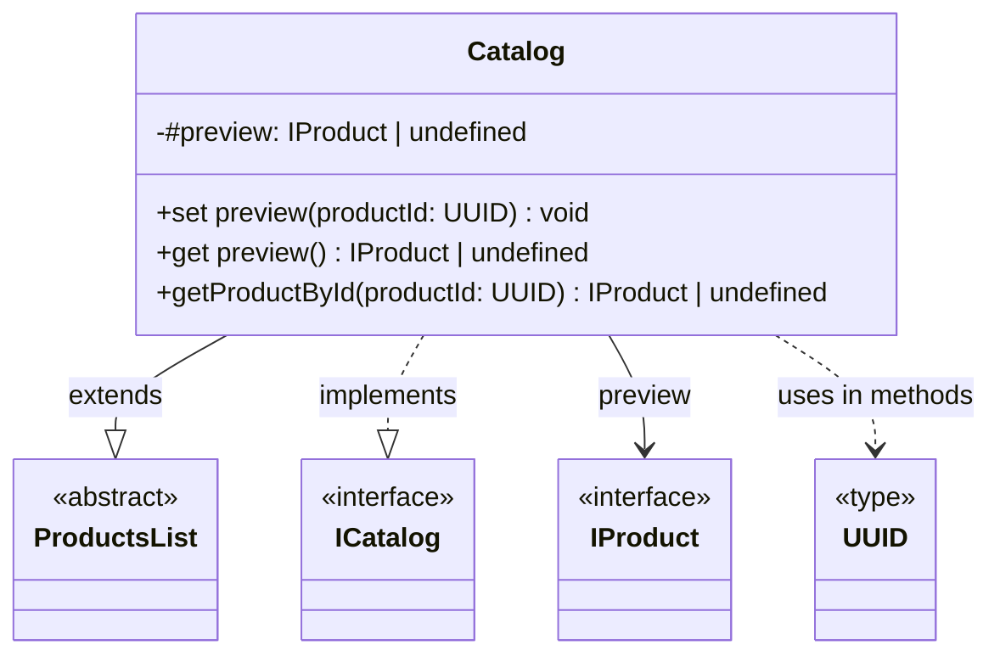

#### КОРЗИНА ПРОДУКТОВ - `Basket`

##### Назначение

Специализированный класс для работы с корзиной товаров, выбранных из каталога.

##### Реализация

Расширяет `ProductsList` и реализует `IBasket`.

##### Конструктор

Принимает и сохраняет в приватное поле `_catalog` экземпляр каталога товаров типа `ICatalog`, из которого выбираются товары в корзину. Вызывает конструктор родительского (расширяемого) специализированного класса `ProductsList`.

```ts
  constructor(private _catalog: ICatalog) {
    super();
  }
```

##### Поля

- приватное поле `_catalog` - экземпляр каталога товаров типа `ICatalog`, из которого выбираются товары в корзину.

##### Методы

- `total` - расчет и получение стоимости корзины типа `Price`:

  ```ts
  get total(): Price {
    return this.products.reduce(
      (cost, product) => product.price ? cost + product.price : cost,
      0)
  }
  ```

- `countProducts` - получение количества товаров в корзине типа `number`:

  ```ts
  get countProducts(): number {
    return this.size;
  }
  ```

- `addProduct` - добавление товара из каталога в в корзину по его идентификатору `id` типа `UUID`. Предварительно проверяется наличие товара по идентификатору в каталоге `_catalog`. Добавляемый товар должен иметь цену.

  ```ts
  public addProduct(id: UUID): void {
    const product = this._catalog.getProductById(id);
    // Проверка наличия товара с идентификатором id и ценой с в каталоге
    if (product && product.price) {
      // Добавление найденного товара из каталога в в корзину
      this.addItem(this._catalog.getProductById(id)!);
    }
  }
  ```

- `delProduct` - удаление из корзины товара с указанным идентификатором `id` типа `UUID`. Предварительно проверяется его наличие в корзине:

  ```ts
  public delProduct(id: UUID): void {
    if (this.hasKey(id)) this.removeByKey(id);
  }
  ```

- `clear` - очистка корзины:

  ```ts
  public clear(): void {
    super.clear();
  }
  ```

- `hasProduct` - проверка наличия товара в корзине по его идентикатору `id` типа `UUID`, возвращающая `true`, если имеется, и `false` - при отсутствует:

  ```ts
  public hasProduct(id: UUID): boolean {
    return this.hasKey(id);
  }
  ```

- `getProductsId` - получение массива идентификаторов типа `UUID` товаров корзины. Разработан для форирования данных, передаваемых в запросе на оформление заказа (покупки).

  ```ts
  getProductsId(): UUID[] {
    return this.products.map(product => product.id)
  }
  ```

##### UML-диаграмма

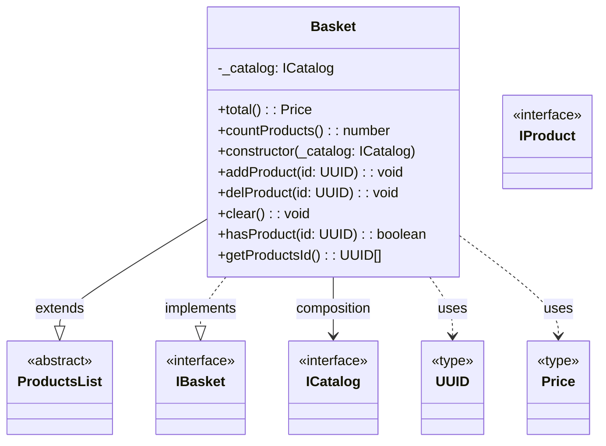

#### ПОКУПАТЕЛЬ - `Buyer`

##### Назначение

Описывает работу с данными покупателя.

##### Реализация

Реализует `IBuyer`.

##### Конструктор

Опционально определяет все свойства покупателя через `buyer`, используя одноименный сеттер.

```ts
  constructor(buyer?: IBuyer) {
    this.buyer = buyer;
  }
```

##### Поля

Все поля - приватные.

- `#payment` - способ оплатиы типа `TPayment`, по умолчанию - не определен (`undefined`)
- `#email` - электронная почта, тип `string`
- `#phone` - телефон, тип `string`
- `#address` - адрес, тип `string`

```ts
  #payment: TPayment = undefined;
  #email: string = '';
  #phone: string = '';
  #address: string = '';
```

##### Методы

- методы получения и определения свойств покупателя: 
  - для каждого отдельного свойства покупателя определены геттеры и сеттеры, принимающие и возвращающие данные соответствующих типов:

    ```ts
    set payment(payment: TPayment) {
    this.#payment = payment;
    }

    get payment() {
    return this.#payment;
    }

    set email(email: string) {
    this.#email = email;
    }

    get email() {
    return this.#email;
    }

    set phone(phone: string) {
    this.#phone = phone;
    }

    get phone() {
    return this.#phone;
    }

    set address(address: string) {
    this.#address = address;
    }

    get address() {
    return this.#address;
    }
    ```

  - для работы одновременно со всеми данными покупателя разработаны геттер и сеттер, принимающий и возвращающий объекты типа `IBuyer`.

```ts
  set buyer(buyer: IBuyer | undefined) {
    buyer && ({
      payment: this.#payment,
      email: this.#email,
      phone: this.#phone,
      address: this.#address
    } = buyer);
  }

  get buyer(): IBuyer {
    return {
      payment: this.#payment,
      email: this.#email,
      phone: this.#phone,
      address: this.#address
    }
  }
```

- методы проверки валидности каждого отдельного и всех сразу свойства покупателя разработаны следующие методы:

```ts
  public isEmailValid(): boolean {
    return this.#email.trim().length > 0;
  }

  public isPhoneValid(): boolean {
    return this.#phone.trim().length > 0;
  }

  public isAddressValid(): boolean {
    return this.#address.trim().length > 0;
  }

  public isPaymentValid(): boolean {
    return !!(this.#payment);
  }

  public isAllValid(): boolean {
    return (
      this.isPaymentValid() &&
      this.isEmailValid() &&
      this.isPhoneValid() &&
      this.isAddressValid()
    )
  }
```

- `clear` - очистка всех полей экземпляра класса покупателя путем сброса к их начальным значениям

```ts
  public clear() {
    this.#payment = undefined;
    this.#email = '';
    this.#phone = '';
    this.#address = '';
  }
```

##### UML-диаграмма

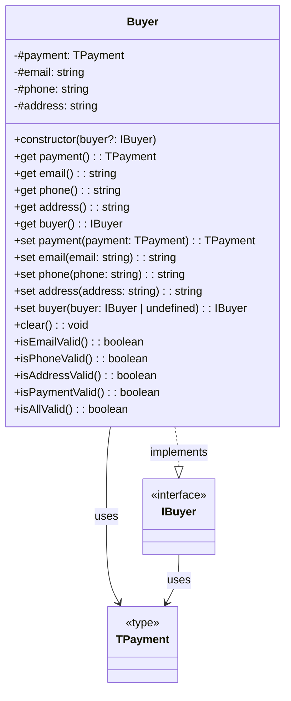

#### ЗАКАЗ ТОВАРА (ПОКУПКА) - `Order`

##### Назначение

Описывает работу с данными заказа (покупки), включающие данные покупателя и его корзины товаров, неободимых, в частности, для запроса на оформление заказа (покупки).

##### Реализация

Реализует композицию данных корзины и покупателя, на основе которых формирует данные для отправки заказа на сервер.

##### Конструктор

Принимает ссылки на объекты c данными о покупателе `buyer` и его корзине `basket`, описываемыми, соответственно, `IBuyer` и `IBasket`, и сохраняет их в приватные поля `#buyer` и `#basket`.

```ts
  constructor(buyer: IBuyer, basket: IBasket) {
    this.#buyer = buyer;
    this.#basket = basket;
  }
```

##### Поля

`#buyer` - объект с данными о покупателе типа `IBuyer`.

`#basket` - объект с данными о корзине покупателя типа `IBasket`.

##### Методы

- `orderData` - формирование данных типа `IOrderData` для отправки заказа (покупки) на сервер

  ```ts
  get orderData(): IOrderData {
    return {
      payment: this.#buyer.payment,
      email: this.#buyer.email,
      phone: this.#buyer.phone,
      address: this.#buyer.address,
      total: this.#basket.total,
      items: this.#basket.getProductsId()
    };
  }
  ```

##### UML-диаграмма

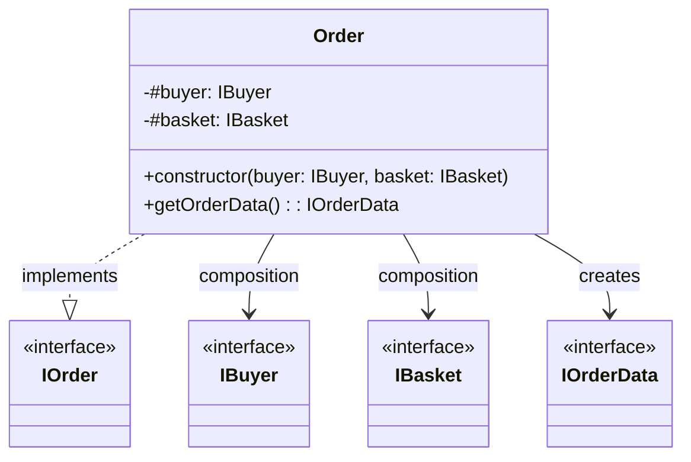


### Коммуникационный слой

#### API WEBLAREK - `larekAPI`

##### Назначение

Специализированный класс для работы с API WEBLAREK (работа с товарами).

##### Реализация

Реализует композицию объекта типа `IApi` и собственные методы на его основе.

##### Конструктор

Принимает объект типа `IApi` и сохраняет ссылку на него в приватном поле `#api`:

```ts
  constructor(api: IApi) {
    this.#api = api;
  }
```

##### Поля

- `#api` - ссылка на объект типа `IApi`, реализующий универсальные методы запроса данных.

```ts
#api: IApi;
```

##### Методы

- `getShopProducts` - запрос из ларька (с сервера) списка товаров (для каталога), в случае успеха возврающий промис данных типа `ILarekProducts` или данных об ошибке типа `Response`:

  ```ts
  public getShopProducts(): Promise<ILarekProducts> {
    return this.#api.get<ILarekProducts>(
      URI_PRODUCTS
    );
  }
  ```

- `placeOrder` - метод post-запроса на оформление заказа, принимающий объект `orderData` типа `IOrderData` с данными о заказе.  
  В случае успеха возврает промис с данными о регистрации заказа (покупке) типа `IPurchaseData` или данными об ошибке типа `Response`:

  ```ts
  placeOrder(orderData: IOrderData): Promise<IPurchaseData> {
    return this.#api.post<IPurchaseData>(
      URI_ORDER,
      orderData,
      'POST'
    );
  }
  ```

##### UML-диаграмма

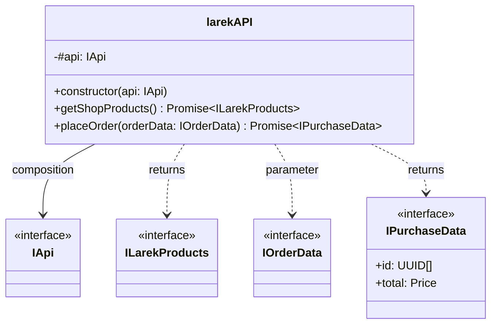
