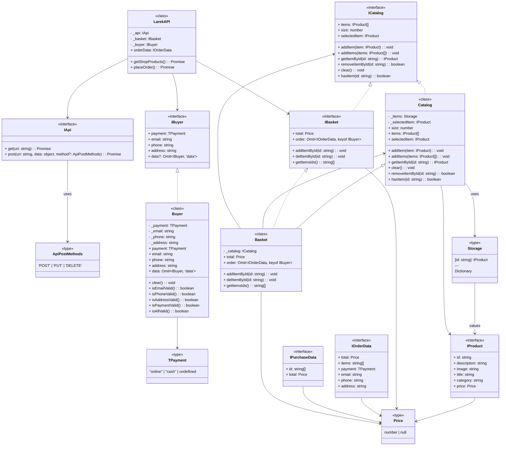

### UML-диаграмма приложения

```mermaid
classDiagram
    %% ========= БАЗОВЫЕ ТИПЫ =========
    class Price {
        <<type>>
        number | null
    }

    class TPayment {
        <<type>>
        "online" | "cash" | undefined
    }

    class ApiPostMethods {
        <<type>>
        'POST' | 'PUT' | 'DELETE'
    }

    class Storage {
        <<type>>
        [id: string]: IProduct
        ---
        Dictionary<string, IProduct>
    }

    %% ========= ИНТЕРФЕЙСЫ =========
    class IProduct {
        <<interface>>
        + id: string
        + description: string
        + image: string
        + title: string
        + category: string
        + price: Price
    }

    class ICatalog {
        <<interface>>
        + items: IProduct[]
        + size: number
        + selectedItem: IProduct
        + addItem(item: IProduct): void
        + addItems(items: IProduct[]): void
        + getItemById(id: string): IProduct
        + removeItemById(id: string): boolean
        + clear(): void
        + hasItem(id: string): boolean
    }

    class IBasket {
        <<interface>>
        + total: Price
        + order: Omit~IOrderData, keyof IBuyer~
        + addItemById(id: string): void
        + delItemById(id: string): void
        + getItemsIds(): string[]
    }

    class IBuyer {
        <<interface>>
        + payment: TPayment
        + email: string
        + phone: string
        + address: string
        + data?: Omit~IBuyer, 'data'~
    }

    class IApi {
        <<interface>>
        + get<T>(uri: string): Promise<T>
        + post<T>(uri: string, data: object, method?: ApiPostMethods): Promise<T>
    }

    class IOrderData {
        <<interface>>
        + total: Price
        + items: string[]
        + payment: TPayment
        + email: string
        + phone: string
        + address: string
    }

    class IPurchaseData {
        <<interface>>
        + id: string[]
        + total: Price
    }

    %% ========= КЛАССЫ =========
    class Catalog {
        <<class>>
        - _items: Storage
        - _selectedItem: IProduct
        + addItem(item: IProduct): void
        + addItems(items: IProduct[]): void
        + getItemById(id: string): IProduct
        + clear(): void
        + size: number
        + removeItemById(id: string): boolean
        + items: IProduct[]
        + hasItem(id: string): boolean
        + selectedItem: IProduct
    }

    class Basket {
        <<class>>
        - _catalog: ICatalog
        + total: Price
        + addItemById(id: string): void
        + delItemById(id: string): void
        + getItemsIds(): string[]
        + order: Omit~IOrderData, keyof IBuyer~
    }

    class Buyer {
        <<class>>
        - _payment: TPayment
        - _email: string
        - _phone: string
        - _address: string
        + payment: TPayment
        + email: string
        + phone: string
        + address: string
        + data: Omit~IBuyer, 'data'~
        + clear(): void
        + isEmailValid(): boolean
        + isPhoneValid(): boolean
        + isAddressValid(): boolean
        + isPaymentValid(): boolean
        + isAllValid(): boolean
    }

    class LarekAPI {
        <<class>>
        - _api: IApi
        - _basket: IBasket
        - _buyer: IBuyer
        + orderData: IOrderData
        + getShopProducts(): Promise<ILarekProducts>
        + placeOrder(): Promise<IPurchaseData>
    }

    %% ========= НАСЛЕДОВАНИЯ =========
    ICatalog <|.. Catalog
    ICatalog <|.. IBasket
    Catalog <|-- Basket
    IBasket <|.. Basket
    IBuyer <|.. Buyer

    %% ========= СВЯЗИ =========
    IApi --> ApiPostMethods : uses
    Storage --> IProduct : values
    Catalog --> Storage : uses
    Catalog --> IProduct
    Basket --> Catalog
    Basket --> ICatalog
    Buyer --> TPayment
    LarekAPI --> IApi
    LarekAPI --> IBasket
    LarekAPI --> IBuyer

    %% ========= СВЯЗИ С Price =========
    IProduct --> Price
    IBasket --> Price
    IOrderData --> Price
    IPurchaseData --> Price
    Basket --> Price

```
