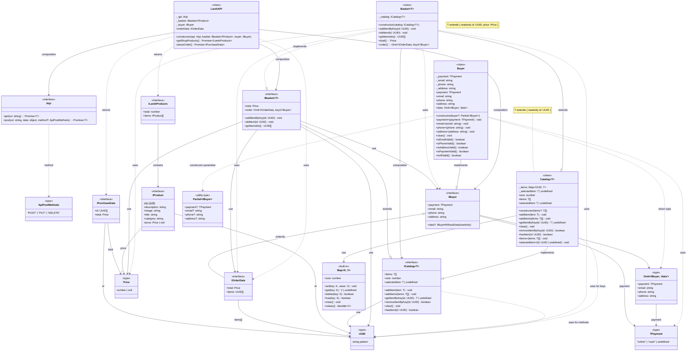

### UML-диаграмма приложения

```mermaid
classDiagram
    class ApiPostMethods {
        <<type>>
        "POST" | "PUT" | "DELETE"
    }

    class IApi {
        <<interface>>
        +get<T>(uri: string): Promise~T~
        +post<T>(uri: string, data: object, method?: ApiPostMethods): Promise~T~
    }

    class ILarekProducts {
        <<interface>>
        +total: number
        +items: IProduct[]
    }

    class IProduct {
        <<interface>>
        +id: UUID$
        +description: string
        +image: string
        +title: string
        +category: string
        +price: Price | null
    }

    class IOrderData {
        <<interface>>
        +total: Price
        +items: UUID[]
    }

    class IBuyer {
        <<interface>>
        +payment: TPayment
        +email: string
        +phone: string
        +address: string
        +data?: IBuyerWithoutData (readonly)
    }

    class UUID {
        <<type>>
        string pattern
    }

    class IPurchaseData {
        <<interface>>
        +id: UUID[]
        +total: Price
    }

    class Price {
        <<type>>
        number  | null
    }

    class TPayment {
        <<type>>
        "online" | "cash" | undefined
    }

    class ICatalog~T~ {
        <<interface>>
        +items: T[]
        +size: number
        +selectedItem: T | undefined
        +addItem(item: T) void
        +addItems(items: T[]) void
        +getItemByKey(id: UUID) T | undefined
        +removeItemByKey(id: UUID) boolean
        +clear() void
        +hasItem(id: UUID) boolean
    }

    class IBasket~T~ {
        <<interface>>
        +total: Price
        +order: Omit~IOrderData, keyof IBuyer~
        +addItemByKey(id: UUID) void
        +delItem(id: UUID) void
        +getItemsIds() UUID[]
    }

    class Omit~IBuyer, 'data'~ {
        <<type>>
    }

    class Catalog~T~ {
        <<class>>
        -_items: Map~UUID, T~
        -_selectedItem: T | undefined
        +constructor(items?: T[])
        +addItem(item: T) void
        +addItems(items: T[]) void
        +getItemByKey(id: UUID) T | undefined
        +clear() void
        +removeItemByKey(id: UUID) boolean
        +hasItem(id: UUID) boolean
        +size: number
        +items: T[]
        +items=(items: T[]) void
        +selectedItem: T | undefined
        +selectedItem=(id: UUID | undefined) void
    }

    class Map~K, V~ {
        <<built-in>>
        +set(key: K, value: V) void
        +get(key: K) V | undefined
        +delete(key: K) boolean
        +has(key: K) boolean
        +clear() void
        +size: number
        +values() Iterable~V~
    }

    class Basket~T~ {
        <<class>>
        -_catalog: ICatalog~T~
        +constructor(catalog: ICatalog~T~)
        +addItemByKey(id: UUID) void
        +delItem(id: UUID) void
        +getItemsIds() UUID[]
        +total(): Price
        +order(): Omit~IOrderData, keyof IBuyer~
    }

    class Buyer {
        <<class>>
        -_payment: TPayment
        -_email: string
        -_phone: string
        -_address: string
        +constructor(buyer?: Partial~IBuyer~)
        +payment: TPayment
        +payment=(payment: TPayment) void
        +email: string
        +email=(email: string) void
        +phone: string
        +phone=(phone: string) void
        +address: string
        +address=(address: string) void
        +data: Omit~IBuyer, 'data'~
        +clear() void
        +isEmailValid() boolean
        +isPhoneValid() boolean
        +isAddressValid() boolean
        +isPaymentValid() boolean
        +isAllValid() boolean
    }

    class Partial~IBuyer~ {
        <<utility type>>
        +payment?: TPayment
        +email?: string
        +phone?: string
        +address?: string
    }

    class Omit~IBuyer, 'data'~ {
        <<utility type>>
        +payment: TPayment
        +email: string
        +phone: string
        +address: string
    }

    class LarekAPI {
        <<class>>
        -_api: IApi
        -_basket: IBasket~IProduct~
        -_buyer: IBuyer
        +constructor(api: IApi, basket: IBasket~IProduct~, buyer: IBuyer)
        +getShopProducts() Promise~ILarekProducts~
        +placeOrder() Promise~IPurchaseData~
        +orderData: IOrderData
    }

    note for Catalog "T extends { readonly id: UUID }"
    note for Basket~T~ "T extends { readonly id: UUID; price: Price }"

    IApi ..> ApiPostMethods : method
    ILarekProducts --> IProduct : contains
    IPurchaseData --> "*" UUID : id
    IPurchaseData --> "1" Price : total
	IBuyer <|-- IOrderData : extends
    IOrderData --> UUID : items[]
	IProduct --> UUID : id
    IProduct --> Price : price
    ICatalog --> UUID : use
	IBasket --|> ICatalog : extends
    IBasket --> Price : use
    IBasket --> UUID : use
    IBasket --> IOrderData : use
    IBasket --> IBuyer : use
	IBuyer --> TPayment : payment
    IBuyer --> Omit~IBuyer, 'data'~ : data
    Omit~IBuyer, 'data'~ --> TPayment : payment
	Basket --|> Catalog : extends
    Basket ..|> IBasket : implements
    Basket --> ICatalog : composition
    Basket ..> Price : uses
    Basket ..> UUID : uses
    Basket ..> IOrderData : uses
    Basket ..> IBuyer : uses
	Buyer --|> IBuyer : implements
    Buyer ..> TPayment : uses
    Buyer ..> Partial~IBuyer~ : constructor parameter
    Buyer ..> Omit~IBuyer, 'data'~ : return type
	LarekAPI --> IApi : composition
    LarekAPI --> IBasket~IProduct~ : composition
    LarekAPI --> IBuyer : composition
    LarekAPI ..> ILarekProducts : returns
    LarekAPI ..> IPurchaseData : returns
    LarekAPI ..> IOrderData : uses
	Catalog --|> ICatalog : implements
    Catalog --> Map~UUID, T~ : use
    Catalog ..> UUID : uses for keys
    ICatalog ..> UUID : uses for methods
```