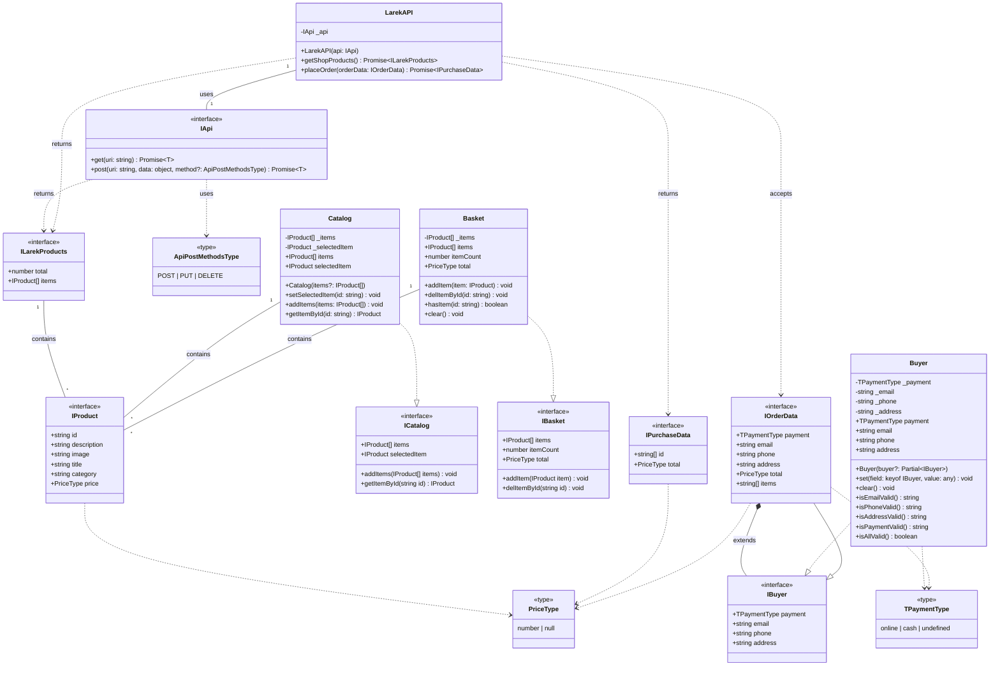

### UML-диаграмма приложения

```mermaid
classDiagram
    %% Интерфейсы
    class IProduct {
        <<interface>>
        +string id
        +string description
        +string image
        +string title
        +string category
        +PriceType price
    }

    class ICatalog {
        <<interface>>
        +IProduct[] items
        +IProduct selectedItem
        +addItems(IProduct[] items) void
        +getItemById(string id) IProduct
    }

    class IBasket {
        <<interface>>
        +IProduct[] items
        +number itemCount
        +PriceType total
        +addItem(IProduct item) void
        +delItemById(string id) void
    }

    class IBuyer {
        <<interface>>
        +TPaymentType payment
        +string email
        +string phone
        +string address
    }

    class IApi {
        <<interface>>
        +get(uri: string) Promise~T~
        +post(uri: string, data: object, method?: ApiPostMethodsType) Promise~T~
    }

    class ILarekProducts {
        <<interface>>
        +number total
        +IProduct[] items
    }

    class IOrderData {
        <<interface>>
        +TPaymentType payment
        +string email
        +string phone
        +string address
        +PriceType total
        +string[] items
    }

    class IPurchaseData {
        <<interface>>
        +string[] id
        +PriceType total
    }

    %% Типы
    class PriceType {
        <<type>>
        number | null
    }

    class TPaymentType {
        <<type>>
        online | cash | undefined
    }

    class ApiPostMethodsType {
        <<type>>
        POST | PUT | DELETE
    }

    %% Классы
    class Catalog {
        -IProduct[] _items
        -IProduct _selectedItem
        +Catalog(items?: IProduct[])
        +IProduct[] items
        +IProduct selectedItem
        +setSelectedItem(id: string) void
        +addItems(items: IProduct[]) void
        +getItemById(id: string) IProduct
    }

    class Basket {
        -IProduct[] _items
        +IProduct[] items
        +number itemCount
        +PriceType total
        +addItem(item: IProduct) void
        +delItemById(id: string) void
        +hasItem(id: string) boolean
        +clear() void
    }

    class Buyer {
        -TPaymentType _payment
        -string _email
        -string _phone
        -string _address
        +Buyer(buyer?: Partial~IBuyer~)
        +set(field: keyof IBuyer, value: any) void
        +TPaymentType payment
        +string email
        +string phone
        +string address
        +clear() void
        +isEmailValid() string
        +isPhoneValid() string
        +isAddressValid() string
        +isPaymentValid() string
        +isAllValid() boolean
    }

    class LarekAPI {
        -IApi _api
        +LarekAPI(api: IApi)
        +getShopProducts() Promise~ILarekProducts~
        +placeOrder(orderData: IOrderData) Promise~IPurchaseData~
    }

    %% Наследование интерфейсов
    IOrderData --|> IBuyer

    %% Реализация интерфейсов
    Catalog ..|> ICatalog
    Basket ..|> IBasket
    Buyer ..|> IBuyer

    %% Ассоциации
    Basket "1" -- "*" IProduct : contains
    Catalog "1" -- "*" IProduct : contains
    LarekAPI "1" -- "1" IApi : uses

    %% Зависимости
    IOrderData ..> TPaymentType
    IOrderData ..> PriceType
    IPurchaseData ..> PriceType
    IProduct ..> PriceType
    Buyer ..> TPaymentType
    
    %% Связи LarekAPI
    LarekAPI ..> ILarekProducts : returns
    LarekAPI ..> IPurchaseData : returns
    LarekAPI ..> IOrderData : accepts
    
    %% Связи IApi
    IApi ..> ApiPostMethodsType : uses
    IApi ..> ILarekProducts : returns
    
    %% Связи ILarekProducts
    ILarekProducts "1" -- "*" IProduct : contains

    %% Композиция
    IOrderData *-- IBuyer : extends
```
