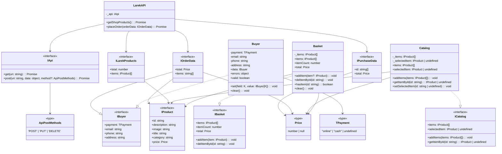

### UML-диаграмма приложения

```mermaid
classDiagram
    %% Интерфейсы
    class IProduct {
        <<interface>>
        +id: string
        +description: string
        +image: string
        +title: string
        +category: string
        +price: Price
    }

    class ICatalog {
        <<interface>>
        +items: IProduct[]
        +selectedItem: IProduct | undefined
        +addItems(items: IProduct[]): void
        +getItemById(id: string): IProduct | undefined
    }

    class IBasket {
        <<interface>>
        +items: IProduct[]
        +itemCount: number
        +total: Price
        +addItem(item: IProduct): void
        +delItemById(id: string): void
    }

    class IBuyer {
        <<interface>>
        +payment: TPayment
        +email: string
        +phone: string
        +address: string
    }

    class IApi {
        <<interface>>
        +get<T>(uri: string): Promise<T>
        +post<T>(uri: string, data: object, method?: ApiPostMethods): Promise<T>
    }

    class ILarekProducts {
        <<interface>>
        +total: number
        +items: IProduct[]
    }

    class IOrderData {
        <<interface>>
        +total: Price
        +items: string[]
    }

    class IPurchaseData {
        <<interface>>
        +id: string[]
        +total: Price
    }

    %% Классы
    class Basket {
        -_items: IProduct[]
        +items: IProduct[]
        +itemCount: number
        +total: Price
        +addItem(item?: IProduct): void
        +delItemById(id: string): void
        +hasItem(id: string): boolean
        +clear(): void
    }

    class Buyer {
        -payment: TPayment
        -email: string
        -phone: string
        -address: string
        +set<K>(field: K, value: IBuyer[K]): void
        +data: IBuyer
        +clear(): void
        +errors: object
        +valid: boolean
    }

    class Catalog {
        -_items: IProduct[]
        -_selectedItem: IProduct | undefined
        +items: IProduct[]
        +selectedItem: IProduct | undefined
        +addItems(items: IProduct[]): void
        +getItemById(id: string): IProduct | undefined
        +setSelectedItem(id: string | undefined): void
    }

    class LarekAPI {
        -_api: IApi
        +getShopProducts(): Promise<ILarekProducts>
        +placeOrder(orderData: IOrderData): Promise<IPurchaseData>
    }

    %% Типы
    class Price {
        <<type>>
        number | null
    }

    class TPayment {
        <<type>>
        "online" | "cash" | undefined
    }

    class ApiPostMethods {
        <<type>>
        'POST' | 'PUT' | 'DELETE'
    }

    %% Наследование и реализация интерфейсов
    Basket ..|> IBasket
    Buyer ..|> IBuyer
    Catalog ..|> ICatalog
    LarekAPI --> IApi

    %% Композиция и агрегация
    Basket --> IProduct
    Catalog --> IProduct
    IOrderData --|> IBuyer
    ILarekProducts --> IProduct

    %% Зависимости
    LarekAPI --> ILarekProducts
    LarekAPI --> IOrderData
    LarekAPI --> IPurchaseData
    Buyer --> TPayment
    Basket --> Price
    Catalog --> Price
    IApi --> ApiPostMethods

    %% Ассоциации
    IOrderData --> Price
    IOrderData --> IProduct
    IPurchaseData --> Price
```
