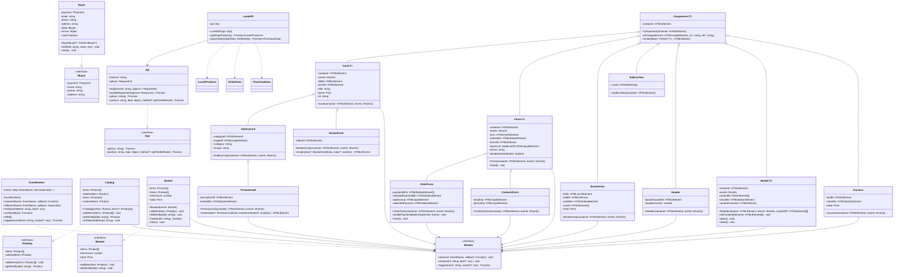

# UML-диаграмма приложения

```mermaid
classDiagram
    %% API Classes
    class Api {
        +baseUrl: string
        -options: RequestInit
        +Api(baseUrl: string, options?: RequestInit)
        -handleResponse(response: Response) Promise
        +get(uri: string) Promise
        +post(uri: string, data: object, method?: ApiPostMethods) Promise
    }

    class LarekAPI {
        -api: IApi
        +LarekAPI(api: IApi)
        +getShopProducts() Promise~ILarekProducts~
        +placeOrder(orderData: IOrderData) Promise~IPurchaseData~
    }

    %% Base Classes
    class Component~T~ {
        -container: HTMLElement
        +Component(container: HTMLElement)
        -setImage(element: HTMLImageElement, src: string, alt?: string)
        +render(data?: Partial~T~) HTMLElement
    }

    class EventEmitter {
        -events: Map~EventName, Set~Subscriber~~
        +EventEmitter()
        +on(eventName: EventName, callback: Function)
        +off(eventName: EventName, callback: Subscriber)
        +emit(eventName: string, data?: any)
        +onAll(callback: Function)
        +offAll()
        +trigger(eventName: string, context?: any) Function
    }

    %% Data Model Classes
    class Catalog {
        -items: IProduct[]
        -selectedItem: IProduct
        +Catalog(events: IEvents, items?: IProduct[])
        +items: IProduct[]
        +selectedItem: IProduct
        +addItems(items: IProduct[]) void
        +getItemById(id: string) IProduct
        +setSelectedItem(id: string) void
    }

    class Basket {
        -items: IProduct[]
        +Basket(events: IEvents)
        +items: IProduct[]
        +itemCount: number
        +total: Price
        +addItem(item: IProduct) void
        +delItemById(id: string) void
        +hasItem(id: string) boolean
        +clear() void
    }

    class Buyer {
        -payment: TPayment
        -email: string
        -phone: string
        -address: string
        +Buyer(buyer?: Partial~IBuyer~)
        +set(field: string, value: any) void
        +data: IBuyer
        +clear() void
        +errors: object
        +valid: boolean
    }

    %% Card Classes
    class Card~T~ {
        -container: HTMLElement
        -events: IEvents
        -titleEl: HTMLElement
        -priceEl: HTMLElement
        +Card(container: HTMLElement, events: IEvents)
        +title: string
        +price: Price
        +id: string
    }

    class GalleryCard {
        -categoryEl: HTMLElement
        -imageEl: HTMLImageElement
        +GalleryCard(container: HTMLElement, events: IEvents)
        +category: string
        +image: string
    }

    class BasketCard {
        -IndexEl: HTMLElement
        +BasketCard(container: HTMLElement, events: IEvents)
        +render(data?: IBasketCardData, index?: number) HTMLElement
    }

    class PreviewCard {
        -descriptionEl: HTMLElement
        -basketBtn: HTMLButtonElement
        +PreviewCard(container: HTMLElement, events: IEvents)
        +render(data?: IPreviewCardData, hasItemInBasket?: boolean) HTMLElement
    }

    %% Form Classes
    class Form~T~ {
        -container: HTMLElement
        -events: IEvents
        -form: HTMLFormElement
        -submitBtn: HTMLButtonElement
        -errorsEl: HTMLElement
        -inputsList: NodeListOf~HTMLInputElement~
        +Form(container: HTMLElement, events: IEvents)
        +errors: string
        +disableSubmitButton: boolean
        +reset() void
    }

    class OrderForm {
        -paymentBtns: HTMLButtonElement[]
        -selectedPaymentBtn: HTMLButtonElement
        -addressInp: HTMLInputElement
        +OrderForm(container: HTMLElement, events: IEvents)
        +selectedPayment: HTMLButtonElement
        -handlePaymentButtonClick(event: Event) void
        +reset() void
    }

    class ContactsForm {
        -emailInp: HTMLInputElement
        -phoneInp: HTMLInputElement
        +ContactsForm(container: HTMLElement, events: IEvents)
    }

    %% View Classes
    class BasketView {
        -listEl: HTMLUListElement
        -totalEl: HTMLElement
        -orderBtn: HTMLButtonElement
        +BasketView(container: HTMLElement, events: IEvents)
        +cards: HTMLElement[]
        +total: Price
    }

    class GalleryView {
        +GalleryView(container: HTMLElement)
        +cards: HTMLElement[]
    }

    class Header {
        -basketCounterEl: HTMLElement
        +Header(container: HTMLElement, events: IEvents)
        +basketCounter: number
    }

    class Modal~T~ {
        -container: HTMLElement
        -events: IEvents
        -contentEl: HTMLElement[]
        -closeBtn: HTMLButtonElement
        -contentContainer: HTMLElement
        +Modal(container: HTMLElement, events: IEvents, contentEl?: HTMLElement[])
        +setСontent(elements: HTMLElement[]) void
        +open() void
        +close() void
    }

    class Success {
        -totalEl: HTMLElement
        -closeBtn: HTMLButtonElement
        +Success(container: HTMLElement, events: IEvents)
        +total: Price
    }

    %% Interfaces
    class IApi {
        <<interface>>
        +get(uri: string) Promise
        +post(uri: string, data: object, method?: ApiPostMethods) Promise
    }

    class IEvents {
        <<interface>>
        +on(event: EventName, callback: Function) void
        +emit(event: string, data?: any) void
        +trigger(event: string, context?: any) Function
    }

    class ICatalog {
        <<interface>>
        +items: IProduct[]
        +selectedItem: IProduct
        +addItems(items: IProduct[]) void
        +getItemById(id: string) IProduct
    }

    class IBasket {
        <<interface>>
        +items: IProduct[]
        +itemCount: number
        +total: Price
        +addItem(item: IProduct) void
        +delItemById(id: string) void
    }

    class IBuyer {
        <<interface>>
        +payment: TPayment
        +email: string
        +phone: string
        +address: string
    }

    %% Inheritance Relationships
    Component <|-- Card
    Component <|-- Form
    Component <|-- BasketView
    Component <|-- GalleryView
    Component <|-- Header
    Component <|-- Modal
    Component <|-- Success
    
    Card <|-- GalleryCard
    Card <|-- BasketCard
    GalleryCard <|-- PreviewCard
    
    Form <|-- OrderForm
    Form <|-- ContactsForm
    
    EventEmitter ..|> IEvents
    Api ..|> IApi
    Catalog ..|> ICatalog
    Basket ..|> IBasket
    Buyer ..|> IBuyer

    %% Composition Relationships
    LarekAPI --> Api
    Catalog --> IEvents
    Basket --> IEvents
    Card --> IEvents
    Form --> IEvents
    BasketView --> IEvents
    Header --> IEvents
    Modal --> IEvents
    Success --> IEvents
    OrderForm --> IEvents
    ContactsForm --> IEvents
    PreviewCard --> IEvents

    %% Dependencies
    LarekAPI ..> ILarekProducts
    LarekAPI ..> IOrderData
    LarekAPI ..> IPurchaseData
```
